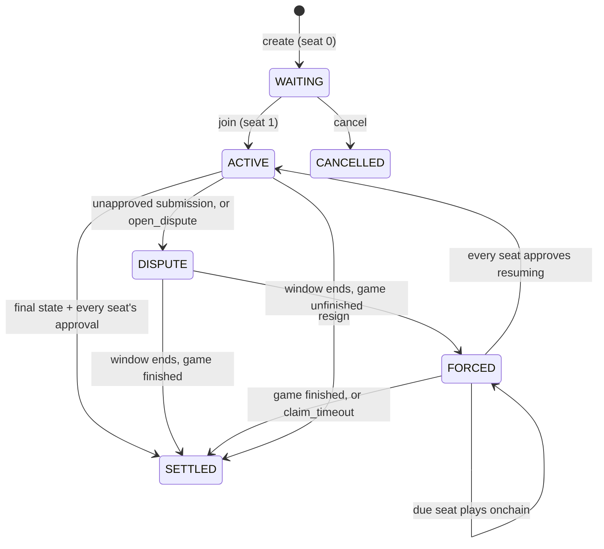

# Referee

Referee lets two players play a turn-based game on Starknet **without a
transaction per move**, while the chain still enforces the rules and the result.

Players exchange signed moves offchain. Only opening a game, settling it, and
resolving disputes touch the chain. Every game writes its rules once, in Cairo.
The same code then:
- validates moves in the players' clients;
- replays disputed history onchain;
- runs inside the Stwo proof that settles the game.

Referee was extracted from [Surround](https://github.com/broody/surround)
(Go) and generalized for games with randomness, such as Hashfront (tactics).

## How a game flows



1. **Open (onchain).** Each player joins with their wallet and registers:
   - a per-game **session key**, which signs moves;
   - the tip of a **hash chain**, which supplies randomness.

   Joining fixes the game's context: chain, contract, players, keys and config.
2. **Play (offchain).** Players send signed steps over any transport.
   - Each signature covers the running transcript, so the history can't be
     reordered or edited afterwards.
   - Clients check every step against the game's rules before they sign
     anything that builds on it.
3. **Settle (onchain).** At the end, both players sign the final state, and
   anyone submits it. The history is either replayed onchain or proved with a
   native Stwo proof, starting from the last committed state. With both
   approvals it settles in one transaction.
4. **When a player misbehaves.**
   - *Won't approve:* the submission becomes a candidate and settles after a
     response window (5 minutes to 7 days, chosen at creation), unless the other
     side posts a newer history.
   - *Stalls:* either player can open a dispute. The game then moves to forced
     onchain play, and the player who misses a turn window loses on timeout.
   - *Gives up:* either player can resign at any time, with a signed step or a
     wallet call.

   Signatures alone never commit a state. A state commits only if it was
   replayed or proved from the last committed state, so two colluding accounts
   cannot sign a fake result into existence.

**Randomness.** When an action needs a dice roll, it goes like this:
1. The acting player attaches the next value from their hash chain.
2. The opponent reveals the next value from theirs.
3. The roll is a hash of both values.

Neither player can predict the roll, and neither can bias it, because both
chains were committed at join. Refusing to reveal only stalls the game, and a
stall ends in a forced reveal or a timeout loss.

## What a game writes

One Cairo trait:

```cairo
pub trait GameRules {
    type Config;   // terms fixed at creation (board size, map, target score)
    type State;
    type Action;
    type Witness;  // optional extra replay input (e.g. move history for Go's superko)
    type Scratch;  // working memory built from the witness
    const TAG: felt252;
    const RULES_VERSION: u32;
    const SEATS: u8;
    fn init(config: @Config) -> State;
    fn load(config: @Config, state: @State, witness: Witness) -> Scratch;
    fn apply(config: @Config, ref scratch: Scratch, state: State, seat: u8, action: Action)
        -> (State, Option<u8>);   // Some(seat) asks that seat to reveal randomness
    fn resolve(config: @Config, ref scratch: Scratch, state: State, seed: felt252) -> State;
    fn due(state: @State) -> u8;
    fn outcome(state: @State) -> Option<(u8, u8)>;   // (winner seat + 1 or DRAW, reason)
}
```

Rules must be deterministic and must panic on illegal actions. Resign, reveal,
recommit, signatures, transcripts and disputes come from referee.
[`examples/counter`](examples/counter/src/lib.cairo) is a complete game, with
dice, in about 100 lines.

With Dojo, the game's onchain contract is one line per entrypoint. See
[`dojo/examples/counter`](dojo/examples/counter/src/lib.cairo):

```cairo
fn join(ref self: ContractState, game_id: felt252, session_key: felt252, rng_tip: felt252) {
    let mut world = self.world_default();
    binding::join::<CounterRules>(ref world, game_id, session_key, rng_tip);
}
```

## What referee provides

| Package | Path | What it does |
|---|---|---|
| `referee` | `core/` | The protocol and the channel's dispute logic as pure functions: step hashing and signatures, transcript replay, forced steps, hash-chain randomness, checkpoint approvals. No Dojo. Builds on Cairo 2.13 and 2.18 |
| `referee_dojo` | `dojo/referee_dojo/` | Dojo models (`ChannelGame`, `ProverAllowed`), the `ChannelUpdated` event, and one helper per entrypoint (create, join, submit, dispute, resolve, force, resume, timeout, resign, prover allowlist) |
| `referee_testing` | `testing/` | Test-only Cairo signer, so tests can sign messages that bind deployed addresses |
| `@referee/sdk` | `sdk/` | JS copy of the protocol hashing and replay. Fixtures keep it byte-identical to the Cairo |

### Status

| | |
|---|---|
| Built and tested | Protocol core, channel state machine, Dojo binding, JS hashing and replay, counter example (pure and as a Dojo world) |
| Not yet | Proof adapter (settlement currently uses onchain replay), relay for moves, keeper, SDK transaction and proof builders, more than 2 seats |

See [DESIGN.md](DESIGN.md) for the protocol details, the proving strategy and
the roadmap.

## Development

```bash
cd sdk && npm install && cd ..
scripts/check.sh
```

`check.sh` regenerates the JS fixtures, then tests:
- the pure crates on Scarb 2.13.1 and 2.18.0;
- the Dojo workspace (`dojo/`) on 2.13.1.

Requirements: Scarb 2.13.1 and 2.18.0 (asdf switches with `ASDF_SCARB_VERSION`),
Sozo 1.8.5 for the Dojo workspace, and Node 22 or later.
