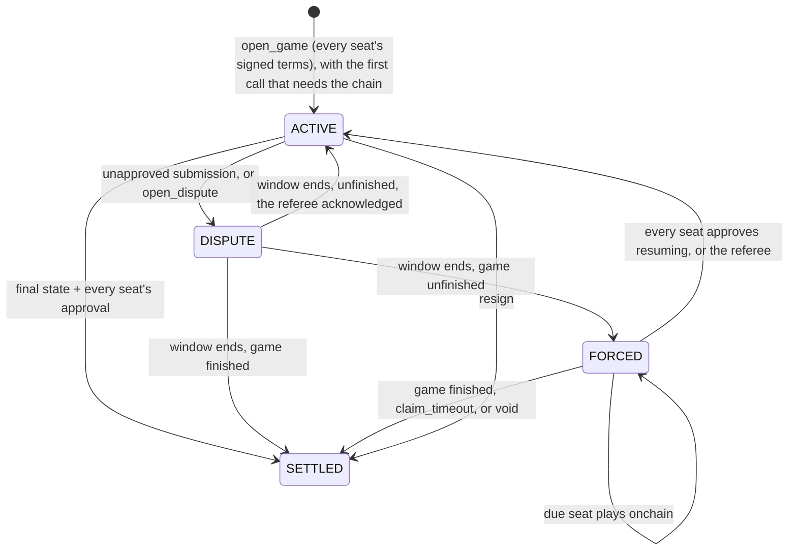

# Referee

Referee lets two players play a turn-based game on Starknet **without a
transaction per move**, while the chain still enforces the rules and the result.

Players exchange signed moves offchain. Only settling a game and resolving
disputes touch the chain, and a game opens onchain in the same transaction as
the first of them. Every game writes its rules once, in Cairo.
The same code then:
- validates moves in the players' clients;
- replays disputed history onchain;
- runs inside the Stwo proof that settles the game.

Referee was extracted from [Surround](https://github.com/broody/surround)
(Go) and generalized for games with randomness, such as Hashfront (tactics).

## Philosophy

**Offchain gameplay, onchain settlement.** Games are played offchain, and the
chain settles their results. A game should touch the chain as little as
possible: ideally one transaction when it settles, plus what a dispute needs.
Anything that adds a transaction to a game needs a reason, namely that it
can't be done offchain or inside the settlement. That covers a separate
transaction to open the game, a proof split into several, or a call a player
has to send. [DESIGN.md](DESIGN.md) records these choices. For example, a game
opens onchain in the same transaction that settles it (protocol v6).

## How a game flows



1. **Agree (offchain).** The players agree on the game's **terms**, and each
   player's wallet signs them. The terms name the chain, the contract, a game
   id the players choose, the wallets, the config, and for each player:
   - a per-game **session key**, which signs moves;
   - the tip of a **hash chain**, which supplies randomness.

   The terms fix the game's context. Nothing is onchain yet: the signed terms
   are the game, and anyone who holds them can open it onchain (`open_game`)
   when it first needs the chain, in the same transaction.
2. **Play (offchain).** Players send signed steps over any transport.
   - Each signature covers the running transcript, so the history can't be
     reordered or edited afterwards.
   - Clients check every step against the game's rules before they sign
     anything that builds on it.
3. **Settle (onchain).** At the end, both players sign the final state, and
   anyone submits it, after `open_game` in the same transaction if nobody has
   opened the game yet. The history is either replayed onchain or proved with
   a native Stwo proof, starting from the last committed state: the opening
   state, for a game that never needed the chain before. With both approvals
   the game opens and settles in one transaction.
4. **When a player misbehaves.**
   - *Won't approve:* the submission becomes a candidate and settles after a
     response window (5 minutes to 7 days, set in the terms), unless the other
     side posts a newer history.
   - *Stalls:* either player can open a dispute, opening the game in the same
     transaction if nobody has yet. The game then moves to forced onchain
     play, and the player who misses a turn window loses on timeout.
     In a timed game the referee flags a staller instead, and while it is live
     it acknowledges disputes, so they return to offchain play.
   - *Gives up:* either player can resign at any time, with a signed step or a
     wallet call.

   Signatures alone never commit a state. A state commits only if it was
   replayed or proved from the last committed state, so two colluding accounts
   cannot sign a fake result into existence.

**Randomness.** When an action needs a dice roll, it goes like this:
1. The acting player attaches the next value from their hash chain.
2. The opponent reveals the next value from theirs.
3. The roll is a hash of both values.

Neither player can predict the roll, and neither can bias it, because both
chains' tips are in the terms both wallets signed. Refusing to reveal only stalls the game, and a
stall ends in a forced reveal or a timeout loss.

A timed game can take its rolls from its referee instead (below), so nobody
waits for the opponent to come online and reveal.

**Clocks (optional).** Two players can't prove time to each other, so a timed
game names a **referee** in its terms, a third key that witnesses time:
- The referee stamps every step with its own clock and signs the resulting
  clocks. Only its last signature reaches the settlement.
- How the clocks run is pluggable: a game names its time rules. The standard
  rules cover per-turn timers, delay, Fischer increments and Japanese
  byo-yomi; a game can write its own (the counter example ships an
  hourglass).
- A seat whose time runs out is flagged by the referee and loses on time. The
  flag settles like any finished game.
- The referee can't forge moves or results. It can only skew time, so an
  honest player's worst case is losing on time. If it disappears, the game
  falls back to the untimed dispute path.
- A game can also take its **randomness from the referee**. The referee
  commits a hash chain of its own, signed for that one game before the
  players sign the terms, and reveals its next value as it stamps a step that
  asks for a roll. The roll is a hash of that value and the acting player's,
  so it resolves at once.
  - The referee can't bias a roll, and can't know one before the step
    arrives. It could leak its next value to the acting player, so players
    trust it not to.
  - If the referee is down, such a game pauses: nobody can be timed out
    while a roll waits for it. Anyone can post the referee's value onchain,
    and after 3 days, or when both players agree, the game ends void, with no
    result.

A [keeper](keeper/README.md) can act as the referee: it already relays every
step.

## What a game writes

One Cairo trait:

```cairo
pub trait GameRules {
    type Config;   // part of the signed terms (board size, map, target score)
    type State;
    type Action;
    type Witness;  // optional extra replay input (e.g. move history for Go's superko)
    type Scratch;  // working memory built from the witness
    const TAG: felt252;
    const RULES_VERSION: u32;
    const SEATS: u8;
    impl Time: ClockRules<State>;   // how its clocks run when timed: referee::clocks::StandardTime<State>
    fn init(config: @Config) -> State;
    fn load(config: @Config, state: @State, witness: Witness) -> Scratch;
    fn apply(config: @Config, ref scratch: Scratch, state: State, seat: u8, action: Action)
        -> (State, Option<u8>);   // Some(seat) asks that seat to reveal randomness
    fn resolve(config: @Config, ref scratch: Scratch, state: State, seed: felt252) -> State;
    fn due(state: @State) -> u8;
    fn outcome(state: @State) -> Option<(u8, u8)>;   // (winner seat + 1 or DRAW, reason)
    fn max_steps(config: @Config) -> u32;            // transcript cap
    fn adjudicate(config: @Config, state: @State) -> (u8, u8);   // the result at the cap
}
```

Rules must be deterministic and must panic on illegal actions. A game bounds
its own length in `outcome`; `max_steps` caps every transcript on top, and
`adjudicate` ends a game that reaches it. Resign, reveal, recommit,
signatures, transcripts and disputes come from referee.
[`examples/counter`](examples/counter/src/lib.cairo) is a complete game, with
dice, in about 100 lines.

With Dojo, the game's onchain contract is one line per entrypoint. See
[`dojo/examples/counter`](dojo/examples/counter/src/lib.cairo):

```cairo
fn open_dispute(ref self: ContractState, game_id: felt252, epoch: u32) {
    let mut world = self.world_default();
    binding::open_dispute(ref world, game_id, epoch);
}
```

## What referee provides

| Package | Path | What it does |
|---|---|---|
| `referee` | `core/` | The protocol and the channel's dispute logic as pure functions: step hashing and signatures, transcript replay, forced steps, hash-chain randomness, referee clocks, checkpoint approvals. No Dojo. Builds on Cairo 2.13 and 2.18 |
| `referee_dojo` | `dojo/referee_dojo/` | Dojo models (`ChannelTerms`, `ChannelState`, `ChannelRng`, `ProverAllowed`), the `ChannelUpdated` event, and one helper per entrypoint (open_game, submit, dispute, acknowledge, resolve, force, roll, void, resume, timeout, resign, prover allowlist) |
| `referee_adapter` | `adapter/referee_adapter/` | Proof adapter logic: the virtual replay that gets proved (`__execute__`) and `settle`, which checks the proof facts and relays the result. Cairo 2.18. A game's adapter contract is about 40 lines |
| `referee_testing` | `testing/` | Test-only Cairo signer, so tests can sign messages that bind deployed addresses |
| `@referee/sdk` | `sdk/` | JS copy of the protocol: hashing, signing, replay, a `Session` per client, a `Referee` for timed games, channel calldata codecs and proof payloads. Fixtures keep it byte-identical to the Cairo. `@referee/sdk/proving` requests a native proof of a session and builds the `settle` call. `@referee/sdk/store` persists sessions (IndexedDB or files) and refuses to sign a step that would equivocate. `@referee/sdk/keeper` talks to a keeper. Install from git: `npm install github:broody/referee#<rev>` |

### Status

| | |
|---|---|
| Built and tested | Protocol core (v6), referee clocks, randomness from the referee, games opened by their players' signatures, channel state machine, Dojo binding, proof adapter (with mocked proof facts), JS hashing and replay, counter example (pure, as a Dojo world, and with an adapter) |
| Proven on Sepolia | Surround (Go) settles full games with one native SNIP-36 proof through `referee_adapter`; see [Surround's results](https://github.com/broody/surround/blob/main/offchain/RESULTS.md) |
| Self-hosted proving | [`prover/`](prover/README.md): StarkWare's transaction prover built from source (PROOF1) behind a gateway that proves only allowlisted referee adapters. Settled a Surround game on Sepolia; its proofs are byte-identical to the hosted prover's |
| Keeper | [`keeper/`](keeper/README.md): archives and forwards each game's verified steps, records equivocation, answers disputes, resolves and settles, referees timed games and gives them their randomness. Tested end to end on a local Katana |
| Not yet | PROOF2 large-path proving (network support expected ~2026-10-10), more than 2 seats |

See [DESIGN.md](DESIGN.md) for the protocol details, the proving strategy and
the roadmap.

## Development

```bash
npm install
scripts/check.sh
```

`check.sh` regenerates the JS fixtures and runs the SDK tests, then tests:
- the pure crates on Scarb 2.13.1 and 2.18.0;
- the Dojo workspace (`dojo/`) on 2.13.1;
- the adapter workspace (`adapter/`) on 2.18.0 with Starknet Foundry 0.63.0.

Requirements: Scarb 2.13.1 and 2.18.0 (asdf switches with `ASDF_SCARB_VERSION`),
Sozo 1.8.5 for the Dojo workspace, Starknet Foundry 0.63.0 for the adapter,
and Node 22 or later. The SDK's Poseidon is committed WebAssembly; rebuilding
it (`npm run poseidon`) also needs Rust with the `wasm32-unknown-unknown`
target.
