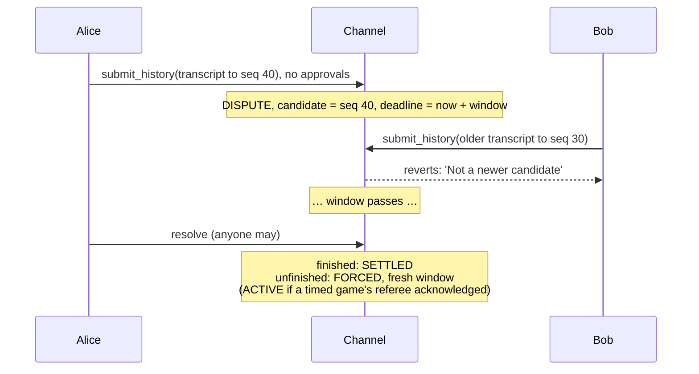
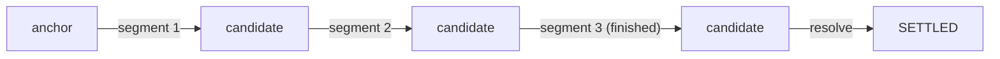
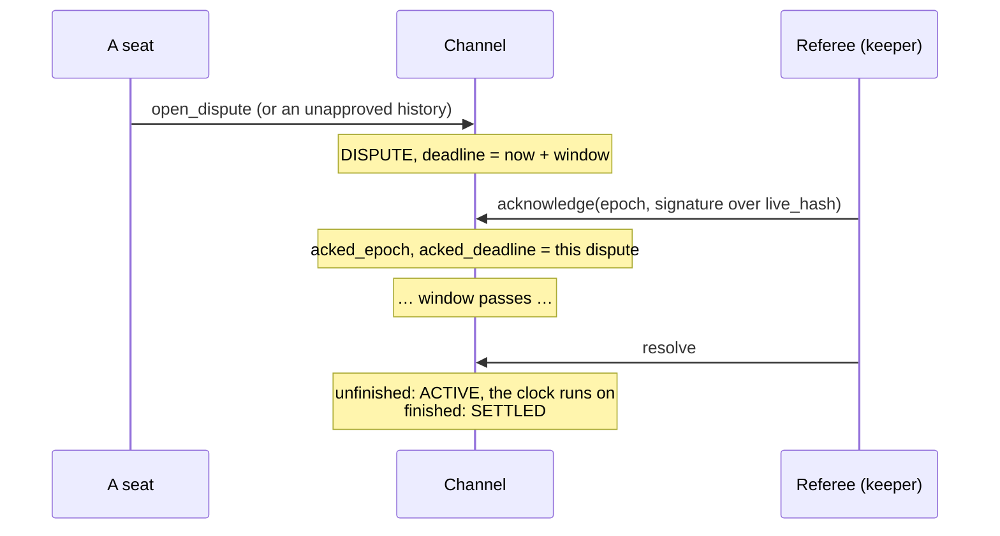

# The channel and disputes

The channel is the onchain half of a game: a small state machine that commits
states only when they are replayed or proved, and falls back to response windows
when players don't cooperate. It's written as pure functions in
[`core/src/channel.cairo`](https://github.com/broody/referee/blob/main/core/src/channel.cairo)
and stored by the Dojo binding.

## What the channel stores

```cairo
pub struct Channel {
    pub status: u8,
    pub epoch: u32,
    pub context: felt252,
    pub response_seconds: u32,
    pub anchor: StateRef,     // the committed state
    pub candidate: StateRef,  // the best submitted state during a dispute
    pub anchor_block: u64,    // block of the last anchor change; proofs must be based at or after it
    pub candidate_block: u64, // block the candidate was set in; a proof that extends it must be based at or after it
    pub deadline: u64,
    pub acked_epoch: u32,     // the dispute (epoch, deadline) a timed game's referee acknowledged
    pub acked_deadline: u64,
    pub result: Outcome,      // once SETTLED
}

pub struct StateRef { pub hash: felt252, pub seq: u32, pub support_turn: u32, pub due: u8, pub outcome: Outcome }
```

States are stored as `StateRef`s: the hash, plus the fields the channel needs to
rank candidates (`support_turn`, `seq`), to know who must move in forced play
(`due`), and to settle (`outcome`). The full envelope is never stored. It
arrives as calldata and is checked against the hash.

## Statuses

| Status | Meaning |
| --- | --- |
| `WAITING` 0 | Created, waiting for seat 1 |
| `ACTIVE` 1 | Played offchain. The anchor is the last committed state |
| `DISPUTE` 2 | A response window is open. The best candidate commits when it closes |
| `FORCED` 3 | Played onchain: the due seat must move within each window |
| `SETTLED` 4 | Finished, with `result` recorded |
| `CANCELLED` 5 | Cancelled before anyone joined |

## Transitions

| Function | Allowed when | Effect |
| --- | --- | --- |
| `create` | | `WAITING`. The response window must be between 300 s and 7 days |
| `join` | `WAITING` | Records the context and the opening state as anchor and candidate. `ACTIVE` |
| `cancel` | `WAITING` | `CANCELLED` |
| `receive(epoch, end, approved)` | `ACTIVE`, or `DISPUTE` before its deadline. `epoch` is current, `end` was replayed or proved from the anchor or the candidate, and `end.seq` is past the anchor | **Approved:** `end` must not rank below the candidate on `support_turn`. It commits as the anchor: `SETTLED` if finished, `ACTIVE` otherwise. **Unapproved:** `end` must outrank the candidate. It becomes the candidate, and an `ACTIVE` channel moves to `DISPUTE` with `deadline = now + window` |
| `open_dispute(epoch)` | `ACTIVE`, current epoch | `DISPUTE`: the candidate resets to the anchor, and `deadline = now + window` |
| `acknowledge(epoch)` | `DISPUTE` before its deadline, current epoch, with the referee's signature (timed games) | Records the dispute's epoch and deadline as acknowledged |
| `resolve(epoch)` | `DISPUTE`, deadline passed | Commits the candidate. `SETTLED` if finished. Otherwise `ACTIVE` if the game is timed and its referee acknowledged this dispute, else `FORCED` with a fresh window |
| `forced(epoch, seat, end)` | `FORCED` before its deadline, and `seat` is the anchor's due seat | Commits `end`. `SETTLED` if finished, otherwise a fresh window |
| `resume(epoch, approved)` | `FORCED` before its deadline, with every seat's reopen approval or, in a timed game, the referee's | `ACTIVE` |
| `claim_timeout(epoch, seat)` | `FORCED`, deadline passed, and `seat` isn't the due seat | `SETTLED`: the due seat forfeits (`REASON_ABANDON`, 130) |
| `resign(seat)` | Any live status (`ACTIVE`, `DISPUTE`, `FORCED`) | `SETTLED`: `seat` forfeits (`REASON_RESIGN`) |

`receive` is what `submit_history` and `accept_verified` call, after replaying
or verifying a proof from the anchor or the candidate. `approved` is true when the submission
carries every seat's checkpoint signature over
`(context, epoch, state hash of end)`, and false when every signature is zero.
Anything else reverts.

## Epochs

`epoch` increments whenever the anchor changes (a commit, `resolve`, a forced
move), and on `resume`, `claim_timeout` and `resign`. Every call that changes
the channel names the epoch it expects, and proofs and approvals bind it too. A
stale submission fails with `'Stale channel epoch'` instead of landing on a
newer state.

## Ranking candidates

In a dispute a new candidate must **outrank** the current one:

```text
end.support_turn > candidate.support_turn
  or (end.support_turn == candidate.support_turn and end.seq > candidate.seq)
```

`support_turn` counts changes of signer. A history the other seat answered
always beats a history that stops before the answer, however many steps one
seat piled on alone. `seq` breaks ties.

An **approved** submission needs only
`end.support_turn >= candidate.support_turn`. Both seats signed off on it, so it
may settle even a dispute that's already running.

## Disputes, step by step

### Stale state

Bob stops answering after losing a big exchange. Alice wants to settle.



Bob can't win by submitting an older history. Alice's candidate already
contains his signatures up to seq 40, and a shorter history ranks lower.

### Stall

Alice opens a dispute from the anchor. If Bob never submits anything, the window
passes and `resolve` commits the anchor itself. The game is unfinished, so it
enters **forced play**:

1. The anchor's due seat must play onchain with `force`: its own steps, from
   the anchor, until the turn passes. The wallet call authenticates them, so
   they carry no signatures.
2. Each forced move commits and opens a fresh window for whoever is due next.
3. If the due seat misses its window, the other seat calls `claim_timeout` and
   wins with `REASON_ABANDON` (130): the chain judged it, not a referee.
4. Both seats can go back to offchain play at any point with reopen approvals
   (`resume`). In a timed game the referee's signature alone is enough
   (`resume_by_referee`).

`resolve` always gives forced play a **fresh** window, so a candidate submitted
at the last second of a dispute can't also steal the next turn by timeout.

### Late candidates don't extend the deadline

The deadline is set once, when the dispute opens. Later candidates replace the
candidate but not the deadline, so a dispute can't be kept open forever by
trickling in newer histories.

### Long histories arrive in segments

A submission may start from the anchor or from the current candidate. Starting
from the candidate extends it, so a history longer than one proof or one
onchain replay arrives as a chain of segments within one window: the first
opens the dispute, and each next one starts where the last ended.



The channel keeps the block each candidate was set in (`candidate_block`). A
proof that extends the candidate must be based at or after that block, as a
proof from the anchor must be based at or after `anchor_block`. Each segment
must still outrank the candidate before it.

## Why signatures alone never commit

The channel never takes a state on the players' word. Every commit comes from
`receive`, which only `submit_history` (an onchain replay from the anchor or
the candidate) and `accept_verified` (a proof of that replay) reach. A
candidate was itself replayed or proved, so every state traces back to the
anchor. Two colluding seats could sign anything, but they can't sign a state
the rules wouldn't produce from the anchor.

## Timed games

A flagged game is a finished history like any other, and the flagged seat can't
outrank it without the referee attesting a competing branch.

Forced play is untimed: its steps carry no stamps, so the referee's clock
stops. It is the fallback for a referee that is down, so a dispute must not
stop a live referee's clock. Two transitions take the referee's signature for
that:

- **`acknowledge`.** During a dispute, the referee signs
  `live_hash(context, epoch, deadline)`, and anyone sends it. The channel
  records that dispute's epoch and deadline (`acked_epoch`, `acked_deadline`).
  When `resolve` then commits an unfinished candidate, the game returns to
  `ACTIVE` instead of `FORCED`, and the clock keeps running offchain.
- **`resume_by_referee`.** In forced play, the referee signs
  `referee_resume_hash(context, epoch, anchor hash)`, and anyone sends it. The
  game returns to offchain play from the anchor, as `resume` does with both
  seats' approvals. A seat can't keep a timed game onchain by refusing to
  approve.



An untimed game has no referee key, so both calls revert with `'Untimed game'`.
See [Clocks and the referee](/concepts/clocks).
