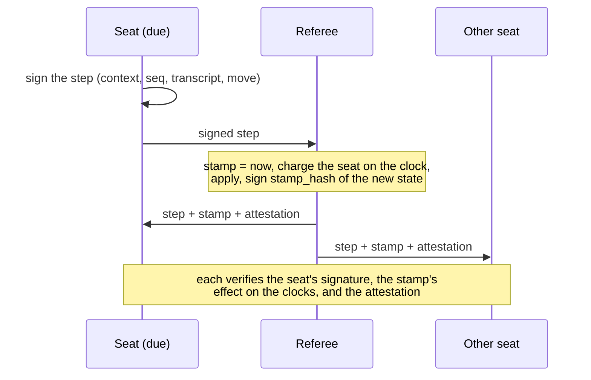

# Clocks and the referee

A timed game names a **referee** in its terms: a third key that witnesses time.
Players sign moves; the referee signs time. This page explains exactly how the
clocks run. For setting one up, see [Add a clock](/guide/clocks).

## The pieces

| | Where | What |
| --- | --- | --- |
| `TimeControl { referee, settings }` | `Terms.clock` (`Option`) | The referee's public key and the settings of the game's time rules, serialized. Fixed at creation and bound into the context |
| `Clock { seats, used, stamp }` | `Envelope.clock` (`Option`) | Each seat's clocks as the time rules keep them (serialized), the time the current turn has used, and the referee time of the last stamp |
| time rules | `GameRules::Time`, a `ClockRules` | What a seat has, and what a finished turn costs |
| stamp | Beside each step, as `u64` milliseconds | The referee's time when the step arrived |
| attestation | Beside each step | The referee's signature over the state the step reached |

## A timed step



- **Stamps stay out of the transcript.** A seat signs its step the same way as
  in an untimed game, so its signature never waits on the referee. A seat can
  sign the rest of its turn from its own unstamped steps (`Session.tip`) while
  they wait for their stamps (`Session.pending`).
- **The attestation** is the referee's signature over
  `signing_hash(TAG, 'REFEREE_STAMP_V1', context, seq, transcript, clock)`: the
  transcript and the clocks after the step. The clocks depend on every stamp so
  far, so the **last** attestation covers them all.
- In a timed game, `Session.receive` refuses a step without a stamp and checks
  every attestation.

## Time rules

The protocol keeps the mechanics: stamps, `used`, turns, reveals, pauses,
flags and attestations. A game's time rules decide what a seat has and what a
finished turn costs. A game names them with `GameRules::Time`, an impl of
`referee::clocks::ClockRules<State>`
([`core/src/clocks.cairo`](https://github.com/broody/referee/blob/main/core/src/clocks.cairo)):

| Function | What it returns |
| --- | --- |
| `check(settings)` | Nothing. Panics on settings a game could not be played under |
| `open(settings, seats)` | Each seat's clocks when the game opens (`Clock.seats`) |
| `limit(settings, clocks, seat, state)` | The time `seat` can use in a turn that starts with `clocks`. Past it, the seat has flagged |
| `settle(settings, clocks, seat, used, reveal, state)` | The clocks the next turn starts with, after `seat` used `used` in a turn, or in its answer to a reveal (`reveal`) |

Settings and clocks cross this interface serialized, so `Terms`, `Envelope`
and the Dojo model are the same for every rule set. A rule set decodes them
into its own types (`decode`, `encode`). It gets the game state, so a turn's
time can depend on the position.

### `StandardTime`

`referee::clocks::StandardTime` covers most clocks, in milliseconds, with
settings `Standard { turn_ms, bank_ms, increment_ms, byoyomi }` and clocks
`StandardClock { banks, periods }`:

- A turn's time comes from `turn_ms` first, which doesn't carry over, then from
  the seat's bank (main time), then from its byo-yomi periods.
- When a turn ends, the bank gains `increment_ms`. An answer to a reveal gains
  nothing.
- With `byoyomi: Some({ periods, period_ms })`, a turn that ends inside a
  period costs none, each period that runs out is lost, and the seat that
  outlasts its last period has flagged (Japanese byo-yomi).

`limit` is `turn_ms + bank + periods × period_ms`.

| Clock | Settings |
| --- | --- |
| Per-turn timer (Surround's old 60 s) | `turn_ms` |
| Delay | `turn_ms` + `bank_ms` |
| Fischer (blitz 3+2) | `bank_ms` 180 s + `increment_ms` 2 s |
| Japanese byo-yomi (10 min + 5 × 30 s) | `bank_ms` 600 s + `byoyomi` 5 × 30 s |

[`examples/counter/src/hourglass.cairo`](https://github.com/broody/referee/blob/main/examples/counter/src/hourglass.cairo)
is a second rule set, where the time a seat uses flows to its opponent, in
about 40 lines.

## How a step is charged

Each stamped step charges the time since the last stamp to the seat **on the
clock**. That's the due seat, or the revealing seat while a reveal is pending.
The protocol's `charge` does this, identically in Cairo and JS:

1. **Unstamped step** (a forced move onchain): the clock **pauses**. Its stamp
   becomes 0 and nobody is charged. The referee's steps can't be unstamped
   (`'Referee step needs a stamp'`).
2. **`Start`**, the referee's step: the clock runs from its stamp, paused or
   not, and nobody is charged. The stamp may not go backwards
   (`'Stamp out of order'`).
3. **The clock isn't running** (stamp is 0: before the first stamp, or after a
   pause): the step starts it at its stamp, and nobody is charged.
4. **Otherwise**, `elapsed = stamp - last stamp` (stamps may not go backwards):
   - the turn's `used` grows by `elapsed`. A pending reveal is a turn of one
     step for the revealer: `elapsed` alone, settled at once with the time
     rules' `settle`, and the turn's `used` is left alone;
   - if that exceeds the rules' `limit` for the seat on the clock, the step
     fails with **`'Flag fell'`**.
5. **When the turn ends**, meaning your game's `due` seat changed, the time
   rules' `settle` turns the finished turn's `used` into the clocks the next
   turn starts with, and `used` starts again from 0.

Withholding a reveal burns the revealer's clock.

## A flag

The referee's `Flag` step is valid only once the seat on the clock has used
more than its `limit`. Before that it fails with `'Clock not expired'`, and on
a paused clock with `'Clock not running'`. A flag ends the game: the seat on
the clock forfeits with `REASON_TIMEOUT` (129). A flag carries no seat
signature (its signature is zero). Its validity is the clock arithmetic above,
and the referee's attestation of the resulting state covers its stamp like any
other.

The earliest flag time is:

```text
flagAt = last stamp + limit of the seat on the clock - used + 1
```

where `used` counts as 0 while a reveal is pending. `session.flagAt()` computes
it. `Referee.deadline()` gives the same time in wall-clock milliseconds, for a
timer.

## Starting the clock

The first stamp starts a paused clock without charging anyone. Without help, a
game's first move would be free, and the referee couldn't flag a seat that
never made it.
The referee's `Start` step fixes that: it sets the clock's stamp and charges no
one, paused or not. The seat on the clock pays from there.

A keeper that referees a game sends a `start` when no step arrives within the
entry's `start_grace_seconds`, and again after play resumes from forced play,
whose stale stamp would otherwise charge the forced period to the due seat.
Seats can't send a `Start`: replay authenticates the referee's steps only
through the attestation, `force` never takes them, and an untimed game refuses
them (`'Untimed game'`).

## Worked example

Terms: `StandardTime` with `turn_ms` 5000, `bank_ms` 60000, `increment_ms`
2000 and no byo-yomi. Alice is seat 0 and moves first. These numbers come from
running the SDK's `Referee`:

| Referee time | Step | Charged | Banks after | Why |
| ---: | --- | --- | --- | --- |
| 1000 | Alice adds 3 | nothing | `[62000, 60000]` | The first stamp starts the clock. The turn passes to Bob, so Alice gains her 2000 increment |
| 4000 | Bob adds 3, 3 s later | 3000, within `turn_ms` | `[62000, 62000]` | The turn ends, so Bob gains 2000 |
| 12000 | Alice adds 3, 8 s later | 5000 `turn_ms` + 3000 bank | `[61000, 62000]` | 62000 − 3000 + 2000 |
| — | Bob is due | | | `flagAt` = 12000 + (5000 + 62000) − 0 + 1 = **79001** |
| 60000 | the referee tries to flag | | | Too early: no flag yet |
| 80000 | Bob's step arrives | | | `'Flag fell'`: refused |
| 80000 | the referee flags | | winner seat 0, reason 129 | Bob forfeits on time |

## Replay and settlement

Onchain, a timed batch carries one stamp per step and the referee's
attestation of the **end** state, alongside each seat's final signature (see
[Steps and transcripts](/concepts/protocol#final-signature-authentication)):

```cairo
Batch { steps, stamps, signatures, attestation }
```

The replay re-runs the charging with the given stamps, then verifies the one
attestation over the resulting clocks. A tampered stamp changes the clocks,
which breaks the attestation. The referee's `Flag` and `Start` steps need no
seat signature: the attestation covers them. An untimed batch has no stamps
and a zero attestation. The Cairo tests `timed_replay_matches_sdk`,
`intermediate_attestation_is_not_a_final_one` and
`tampered_stamp_breaks_the_attestation` cover this.

A flagged game is a finished history like any other, and the flagged seat
can't outrank it without the referee attesting a competing branch.

## Disputes and forced play

Forced steps are applied onchain without stamps, so they pause the clock. The
channel's response windows keep time during forced play instead. When the game
resumes offchain, the clock restarts without charging anyone for the gap.

Forced play is the fallback for a referee that is **down**. A dispute must not
stop a live referee's clock, so the referee has two calls of its own (see
[The channel and disputes](/concepts/channel#timed-games)):

- **`acknowledge`**: during a dispute, the referee signs
  `live_hash(context, epoch, deadline)`. When the window passes, `resolve`
  commits the best candidate and returns an unfinished game to `ACTIVE`, not
  `FORCED`. The clock keeps running offchain, and a staller is flagged there.
- **`resume_by_referee`**: in forced play, the referee signs
  `referee_resume_hash(context, epoch, anchor hash)` to return the game to
  offchain play on its own, once it is back.

Anyone may send either signature. A keeper that referees the game sends both.

## Trust

The referee is the one party of a timed game that players trust, and only with
time:

- **It can't** forge, reorder or edit moves: seats sign them. It can't settle
  anything the rules wouldn't produce either.
- **It can** skew time, by stamping late or early, and censor, by refusing to
  stamp. An honest seat's worst case is losing on time.
- **It decides where a dispute goes.** Its acknowledgement keeps an unfinished
  dispute out of forced play, and its signature brings a game back from forced
  play. Neither changes a state: a dispute still commits its best candidate,
  and a resume starts from the anchor.
- **It can't equivocate unnoticed.** Two attestations at one seq with different
  transcripts are evidence. The keeper never stamps a second step at a seq it
  has already stamped.
- **Players opt in** per game: the referee's key is in the terms, and joining
  accepts it.

## Cost

| | Extra calldata and work |
| --- | --- |
| Untimed game | 1 felt in the terms and in the envelope, and 3 felts per replay (empty stamps, zero attestation). About 12k gas per step for carrying the optional clock |
| Timed game | 1 felt per step, the clock in the envelope, and one extra ECDSA check (about 45k gas) per replay or proof. About 50k gas per step with `StandardTime` |

These gas figures are for the counter game in `cairo-test`. Offchain, a stamp
costs the referee about 2.3 ms, and applying a stamped step costs a client
about 2.4 ms, mostly two signature checks.

## The keeper as referee

A [keeper](/infra/keeper) started with a referee key referees every timed game
whose terms name that key:

- **Stamps** each unstamped step when it arrives, before archiving and
  forwarding it. A step arriving after its seat's time ran out is refused, and
  the seat is flagged.
- **Starts** a clock that no step started within `start_grace_seconds`.
- **Flags** from a timer per game, set to the due seat's deadline. The watcher
  then settles the flagged game like any finished one.
- **Acknowledges** each dispute with an unfinished candidate at once, and **resumes**
  a game from forced play with `resume_by_referee`. While the channel is in
  forced play, it stamps nothing and flags no one.
- **Resumes** each clock at its last stamp after a restart, so seats aren't
  charged for its downtime.
- **Registers** the timed games that join onchain naming its key, when its
  config names the game's Dojo `world` and `namespace`, so such a game gets a
  referee even if neither seat registers it.
- **Stops** refereeing a game whose transcript reaches the entry's
  `max_steps`.
- A keeper that isn't a game's referee archives and forwards only stamped steps.
