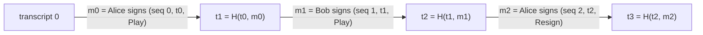

# Steps and transcripts

This page covers the protocol at the level of individual steps: what a step is,
what a seat signs, how the transcript chains them, and how a replay
authenticates a whole batch with one signature per seat. The Cairo lives in
[`core/src/protocol.cairo`](https://github.com/broody/arbiter/blob/main/core/src/protocol.cairo),
and the JS mirror in `@arbiter/sdk`.

## The envelope

The protocol wraps your game's state in an `Envelope`, and every hash, replay
and dispute works on envelopes:

| Field | Meaning |
| --- | --- |
| `seq` | Number of steps applied since the game opened |
| `transcript` | Hash chain of every step's message (0 at the opening) |
| `support_turn` | Number of times the signing seat changed. The referee's steps don't count. Ranks dispute candidates |
| `last_seat` | The last seat that signed a step (`NO_SEAT` 255 at the opening) |
| `pending` | A randomness request waiting for a reveal: `{ active, seat, seq, entropy }`. `seat` is a seat, or `REFEREE` when the referee must reveal |
| `rng_heads` | Each seat's last revealed hash-chain value (its committed tip at first) |
| `rng_fresh` | Per seat, whether its head is a tip it committed and hasn't revealed from yet. A seat may `Recommit` only once this is false |
| `rng_referee` | The referee's last revealed hash-chain value (its committed tip at first), or zero when the seats reveal to each other. See [Randomness](/concepts/randomness#randomness-from-the-referee) |
| `clock` | A timed game's clocks, `None` otherwise. See [Clocks and the referee](/concepts/clocks) |
| `outcome` | `{ finished, winner, reason }` |
| `game` | Your `GameRules::State` |

The **state hash** is `poseidon(TAG, 'ARBITER_STATE_V1', envelope…)`. The channel
stores state hashes, and anchors, candidates and proofs all refer to states by
their hash.

## Steps

A step is a `Move<A>`, where `A` is your game's action:

| Move | Payload | Whose step (`actor`) |
| --- | --- | --- |
| `Play(A)` | Your action | The seat your `due` names |
| `PlayRandom((A, entropy))` | An action whose `apply` requests randomness, and the actor's next hash-chain value | The seat your `due` names |
| `Reveal(value)` | The revealer's next hash-chain value | The seat named by the pending request, or the referee (`REFEREE`) in a game that takes its randomness from it |
| `Recommit(tip)` | A new hash-chain tip | The seat your `due` names, once it has revealed from its current tip |
| `Resign(seat)` | The resigning seat | That seat: either seat may resign at any time |
| `Flag` | Nothing | The referee of a timed game (`REFEREE`, 254) |
| `Start` | Nothing | The referee of a timed game (`REFEREE`), to start or restart the clock |

The seat is implied by the state, so it's never carried or signed twice. Only
`Resign` names one. Other checks follow from `actor`: while a reveal is pending
nothing but `Reveal` is allowed (`'Reveal pending'`), and a `Reveal` with
nothing pending fails (`'No reveal due'`).

`Flag` and `Start` are the referee's steps, and so is a **roll**: the
referee's `Reveal`, in a game that takes its randomness from the referee. They
carry no seat signature: a replay authenticates them only through the
referee's attestation of a timed game (see
[Clocks and the referee](/concepts/clocks)), so an untimed game rejects them
(`'Untimed game'`), and `force` never takes them. A roll must also be the next
value of the hash chain the referee committed. In forced play that chain alone
authenticates it, so anyone may post it onchain (`roll`).

## Every game ends

Your `GameRules::outcome` bounds the game's own length, with a move or round
limit. On top of that, `GameRules::max_steps(config)` caps the transcript. At
the first step at or past `max_steps` that leaves no reveal pending, the
protocol ends the game with your `adjudicate(config, state)`, which returns
`(winner, reason)` as `outcome` does. A random action is never cut between its
`PlayRandom` and its `Reveal`.

The cap is a safety net for transcripts, proofs and keeper archives, not the
game's own limit. Set it to at least the longest game times (1 + protocol
steps per game action). See [Write the rules](/guide/rules#max_steps-and-adjudicate).

## What a seat signs

```text
message = signing_hash(TAG, 'ARBITER_ACTION_V1', context, seq, transcript, move…)
```

- **`context`** binds the game (see below), so a signature can't move to
  another game, contract or chain.
- **`seq` and `transcript`** bind the position. A signature is valid only as
  the next step after exactly that history.
- **`move…`** is the step's Cairo serialization.
- **`signing_hash`** is Poseidon masked to 250 bits, the range STARK-curve
  ECDSA accepts. The mask is explicit in both Cairo and JS.

A step binds the transcript, not the full state. The state is determined by the
anchor plus the transcript, and hashing a large game state on every step would
be expensive to prove.

After the step is applied:

```text
transcript' = poseidon(transcript, message)
seq'        = seq + 1
```



Each signature covers every step before it through the transcript. Reordering,
dropping or editing any earlier step changes every later message.

## The context

```text
context = poseidon(TAG, 'ARBITER_CHANNEL_V1', PROTOCOL_VERSION, RULES_VERSION, terms…)
```

The **terms** are everything both seats agreed to: each seat's wallet signs
them (SNIP-12 typed data over the game and its context), and the channel opens
the game only on every seat's signature:

| Term | |
| --- | --- |
| `chain_id`, `channel`, `game_id` | Which game, on which contract and chain |
| `prover` | The proof adapter allowed to settle it |
| `response_seconds` | The dispute and forced-play window |
| `clock` | The time control, or `None` for an untimed game: the referee's key, the time settings, and the referee's hash-chain tip when the game takes its randomness from it |
| `players`, `keys`, `rng_tips` | Per seat: wallet, session public key, hash-chain tip |
| `config` | Your game's `Config` |

`PROTOCOL_VERSION` is 6, so signatures made under an older protocol never verify
under this one. `RULES_VERSION` does the same for your rules.

## Domain tags

Every digest starts with the game's `TAG` and a purpose tag, so a signature for
one purpose can never be reused for another:

| Tag | Hash of |
| --- | --- |
| `ARBITER_CHANNEL_V1` | The context |
| `ARBITER_STATE_V1` | A state (envelope) |
| `ARBITER_ACTION_V1` | A step's message, signed by a seat |
| `ARBITER_CHECKPOINT_V1` | A checkpoint approval: `(context, epoch, state hash)`, signed by every seat |
| `ARBITER_REOPEN_V1` | A reopen approval, to resume offchain play after forced play |
| `ARBITER_STAMP_V1` | A referee attestation: `(context, seq, transcript, clock)` |
| `ARBITER_LIVE_V1` | The referee's acknowledgement of a dispute: `(context, epoch, deadline)` |
| `ARBITER_RESUME_V1` | The referee's approval to resume offchain play from forced play: `(context, epoch, anchor hash)` |
| `ARBITER_TIP_V1` | The referee's commitment of its hash-chain tip to one game: `(chain id, channel, game id, tip)` |
| `ARBITER_VOID_V1` | A void approval, to end a game whose roll waits for a referee that is down: `(context, epoch, anchor hash)`, signed by every seat |
| `ARBITER_RNG_V1` | One hash-chain link |
| `ARBITER_SEED_V1` | The seed handed to `resolve` |
| `ARBITER_PROVED_V1` | The transition a proof commits to |

## Final-signature authentication

A replay (`replay`, used by `submit_history` and the proof adapter) takes a
**batch**:

```cairo
pub struct Batch<A> {
    pub steps: Span<Move<A>>,
    pub stamps: Span<u64>,          // one per step in a timed game; empty otherwise
    pub signatures: Span<Signature>, // one per seat
    pub attestation: Signature,     // the referee's, in a timed game; zero otherwise
}
```

It carries **one signature per seat**: that seat's last signature in the batch,
or a zero signature if the seat has no step in it. The replay applies every
step, remembers each seat's last message, and verifies only those final
signatures. The referee's steps (`Flag`, `Start`, a roll) count for no seat;
the attestation covers them.

That's sufficient because a seat's last signature covers the transcript, and
through it every earlier step. The trade-off is that the chain never sees
intermediate signatures, so clients must: **`Session` verifies every signature
it receives, and clients never sign from a state they haven't fully
verified.** Intermediate signatures therefore never reach calldata or a proof,
which keeps settlement small. A Surround stone costs 3 felts of calldata.

The Cairo tests `tampered_earlier_step_breaks_final_signature`,
`intermediate_signature_is_not_a_final_one` and
`seat_without_steps_signs_nothing` pin this down.

## Four ways to apply steps

| Function | Authenticates | Used for |
| --- | --- | --- |
| `replay` | Each seat's final signature, and in a timed game the referee's final attestation | `submit_history`, the proof adapter |
| `force` | Nothing: every step must belong to one given seat, which the caller authenticates. The referee's steps never do | Forced play, where the wallet call authenticates the due seat |
| `roll` | One step, the referee's roll: its value must be the next one of the hash chain the referee committed | Forced play that waits for the referee's roll, where anyone may post the value |
| `apply_steps` | Nothing | Clients and tests that already verified every signature |

All four extend the transcript identically, so their results can be mixed
freely: a forced step onchain chains into the next offchain step.

## Signer changes rank candidates

`support_turn` counts changes of signing seat. When the channel compares two
histories in a dispute, the one with more signer changes wins, then the one
with more steps. Say Alice signs a move, Bob answers, and then Alice submits the
state from before Bob's answer. Bob's history has one more signer change, so it
beats hers. Consecutive steps by one seat never outrank a branch the other seat
acknowledged. The referee's steps count for neither seat: a `Start` or a roll
acknowledges nothing, so it never raises `support_turn`. See
[The channel and disputes](/concepts/channel).
