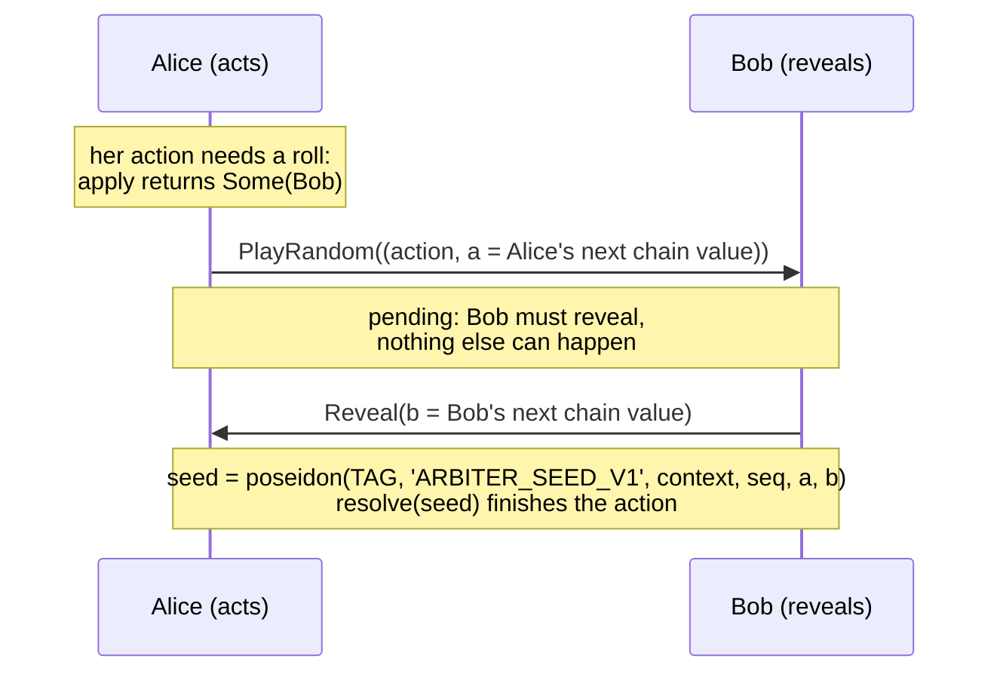
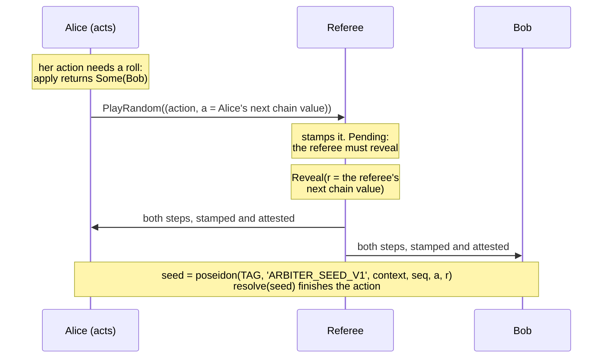

# Randomness

Games with dice, shuffles or hit chances need randomness that neither player can
predict or bias, without an oracle. Arbiter builds it from committed hash
chains: each roll mixes one fresh value from the seat that acts and one from a
revealer. The revealer is the other seat by default. A timed game can have its
referee reveal instead, so no seat has to be online for a roll (see
[Randomness from the referee](#randomness-from-the-referee)).

## Hash chains

Each seat picks a random `seed` and computes a chain:

```text
c0 = seed
c(k+1) = rng_next(ck) = poseidon('ARBITER_RNG_V1', ck)
tip = c(len)
```

The seat commits only the **tip**, in the terms its wallet signs. Later it reveals
values walking back down the chain: `c(len-1)`, then `c(len-2)`, and so on. A
revealed value is valid when `rng_next(value)` equals the seat's current head,
which starts at the tip and moves down with each reveal. Nobody can compute the
next value from the head, because that would mean inverting Poseidon.

```js
import { rngChain } from '@arbiter/sdk'
const chain = rngChain(seed, 64)   // chain[64] is the tip; reveal chain[63], chain[62], …
```

## A roll

By default the seats reveal to each other. An untimed game always works this
way.



1. Alice's action needs randomness: your `apply` returns `Some(other_seat)`.
   She must send it as `PlayRandom`, attaching her next chain value. `Play`
   fails with `'Randomness requested'`, and `PlayRandom` of an action that
   doesn't request randomness fails with `'Unexpected entropy'`.
2. The step records a pending request. Until Bob reveals, the only valid steps
   are Bob's `Reveal`, a resignation, and in a timed game the referee's `Flag`
   or `Start`.
3. Bob reveals his next chain value. The protocol computes the seed from both
   values, the context and the request's `seq`, and calls your `resolve`.

## Why it can't be predicted or biased

- **Neither seat can predict the roll.** It depends on Bob's value, which only
  Bob knows until he reveals it, and on Alice's value, which Bob sees only
  after Alice has signed her action.
- **Neither seat can bias it.** Both values were fixed when the tips were
  committed in the signed terms. Alice can't pick a convenient `a`, and Bob can't pick a
  convenient `b` after seeing `a`: each has exactly one valid next value.
- **Withholding only stalls.** Bob can refuse to reveal, but that doesn't change
  the roll. It stops the game, and a stall ends in a dispute, forced play
  (where he must reveal onchain) and a loss on timeout. In a timed game,
  withholding a reveal burns his clock.

The seed also mixes in the context and the request's `seq`, so two games, or
two rolls in one game, never share a seed even if the chain values collided.

## Randomness from the referee

A timed game can take its randomness from its referee. The seat that acts
still attaches its own chain value, and the referee reveals in place of the
other seat. The referee already stamps every step of a timed game, so it rolls
as it stamps, and no seat waits for the other.

### Opting in

The terms opt in, not the rules. `TimeControl.rng_tip` is the tip of the
referee's own hash chain, or zero when the seats reveal to each other:

| The terms' `clock` | Who reveals |
| --- | --- |
| `None`: an untimed game | The seat your `apply` names |
| `rng_tip` is zero | The seat your `apply` names |
| `rng_tip` is non-zero | The referee, whichever seat your `apply` names |

The opening envelope copies the tip into `rng_referee`, the referee's chain
head. Your rules don't change: `apply` still returns `Some(other_seat)`.

### A roll from the referee



1. Alice sends her action as `PlayRandom` with her next chain value, as
   before.
2. The step records a pending request for the referee: `pending.seat` is
   `REFEREE` (254), and so is `due`. No seat is due.
3. The referee's value is an ordinary `Reveal(value)`. It's valid when
   `rng_next(value)` equals `rng_referee`, which then moves down to `value`.
   Anything else fails with `'Invalid reveal'`. The protocol mixes it with
   Alice's value by the same `seed` function, and calls your `resolve`.

That `Reveal` is a **roll**. It's a referee step, like `Flag` and `Start`:

- **It carries no seat signature.** In a replay, the referee's hash chain
  authenticates the value, and the referee's attestation covers the step.
- **It charges nobody.** The wait for a roll is nobody's time, and the next
  seat's time runs from the roll's stamp.
- **Nobody is flagged meanwhile.** While the referee owes a roll, a `Flag`
  fails with `'Roll pending'`. A seat may still `Resign`.
- **It isn't a signer change.** `support_turn` and `last_seat` only follow
  seats.

### The referee's tip

The tip must be the referee's. A tip a seat made up would let that seat know
every roll. So the referee signs its tip for one game:

```text
message = signing_hash(TAG, 'ARBITER_TIP_V1', chain_id, channel, game_id, tip)
```

The message names the game by its ids, because the tip is part of the terms
that the context hashes: the referee signs it before the seats sign the terms.

1. The clients work out the game id (their wallets' and session keys',
   `gameIdOf`), then get the referee's tip for that game, with its signature. A keeper serves them (`KeeperClient.tip`).
2. The terms carry the tip as `clock.rng_tip`. Each seat checks the signature
   (`tipHash` in the SDK) before its wallet signs the terms.
3. `open_game` takes the signature and verifies it with the referee's key
   (`tip_hash`). A tip signed for another game, or by another key, is refused,
   and so is a referee signature in a game whose seats reveal.

[Add a clock](/guide/clocks#take-randomness-from-the-referee) walks through
it.

The referee has no `Recommit`: that step belongs to a seat. Its chain must
last the whole game. A keeper's chain has a value for every roll the game's
`max_steps` allows.

### What the referee can and can't do

- **It can't bias a roll.** Its values were fixed when its tip was committed.
  It has exactly one valid next value.
- **It can't know a roll before the step arrives.** The seed mixes in the
  requester's chain value, which the referee first sees with the signed step.
- **It knows its own next value ahead of time.** A referee that colluded with
  the requester could leak that value before the action is signed, and the
  requester would know the roll in advance. Players trust it not to.
  Randomness joins time in what the referee is trusted with.
- **It can cancel a game, but not re-roll.** A referee that withholds a roll
  gets no second one: the game pauses, and at worst ends void.

Seat commit-reveal needs no trusted party, and stays the default.

### If the referee is down

A game that waits for the referee's roll pauses:

- **Offchain**, nothing moves without the referee anyway, since every step of a
  timed game needs its stamp. A restarted keeper answers a roll it owed.
- **In forced play**, a seat may play a `PlayRandom` onchain. No seat is due
  after it, so nobody can be timed out, and forced play pauses for up to 3
  days (`PAUSE_SECONDS`). During the pause anyone can post the referee's value
  onchain (`roll`), or the referee can take the game back offchain
  (`resume_by_referee`) and roll there. Otherwise the game ends **void**: at
  once if both seats agree, or by anyone once the pause has run out.

A void game has no result (`REASON_VOID`, 131). It isn't a draw, even though
its `winner` is 0. See
[The channel and disputes](/concepts/channel#a-roll-that-waits-for-the-referee).

## Running out: `Recommit`

A chain of length `len` supplies `len` values. Before it runs out, the due seat
sends `Recommit(new_tip)` on its own turn, with a fresh chain. After a
recommit, the seat reveals from the new chain.

A recommit has two limits:

- It can't happen while a reveal is pending (`'Reveal pending'`).
- It needs a value revealed from the current tip first: a `PlayRandom`'s
  entropy or a `Reveal`. The envelope tracks this per seat in `rng_fresh`,
  which is true while a seat's head is a tip it hasn't revealed from. A second
  recommit in a row fails with `'Nothing revealed to recommit'`.

The second limit keeps a seat from padding the transcript with recommits. A
game that never requests randomness never reveals, so its seats can't recommit
at all.

## In the client

Clients keep the seed and the length with the session key (`store.saveKey`),
because losing the seed means being unable to reveal. The next value to reveal
is the one that hashes to the seat's current head:

```js
function nextValue(session, seat, { seed, length }) {
  const chain = rngChain(seed, length), head = session.env.rng_heads[seat]
  const at = chain.findIndex(v => v === head)
  if (at <= 0) throw Error('Chain exhausted: recommit a new tip first')
  return chain[at - 1]
}
```

In a game that takes its randomness from the referee, a seat uses its chain
only for the value it attaches to `playRandom`. It never sends a `reveal`: the
roll arrives from the referee.

See [Build the client](/guide/client#randomness).
