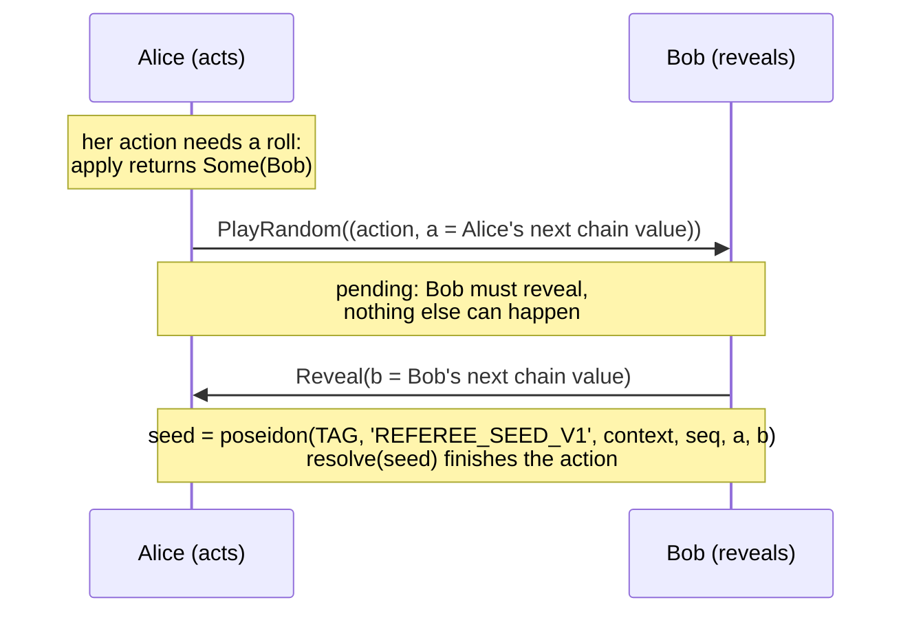

# Randomness

Games with dice, shuffles or hit chances need randomness that neither player can
predict or bias, without an oracle. Referee builds it from two committed hash
chains: each roll mixes one fresh value from each seat.

## Hash chains

Each seat picks a random `seed` and computes a chain:

```text
c0 = seed
c(k+1) = rng_next(ck) = poseidon('REFEREE_RNG_V1', ck)
tip = c(len)
```

The seat commits only the **tip**, when it creates or joins. Later it reveals
values walking back down the chain: `c(len-1)`, then `c(len-2)`, and so on. A
revealed value is valid when `rng_next(value)` equals the seat's current head,
which starts at the tip and moves down with each reveal. Nobody can compute the
next value from the head, because that would mean inverting Poseidon.

```js
import { rngChain } from '@referee/sdk'
const chain = rngChain(seed, 64)   // chain[64] is the tip; reveal chain[63], chain[62], …
```

## A roll



1. Alice's action needs randomness: your `apply` returns `Some(other_seat)`.
   She must send it as `PlayRandom`, attaching her next chain value. `Play`
   fails with `'Randomness requested'`, and `PlayRandom` of an action that
   doesn't request randomness fails with `'Unexpected entropy'`.
2. The step records a pending request. Until Bob reveals, the only valid steps
   are Bob's `Reveal`, a resignation, and in a timed game the referee's `Flag`
   or `Start`.
3. Bob reveals his next chain value. The protocol computes the seed from both
   values, the context and the request's `seq`, and calls your `resolve`.

## Why it can't be predicted or biased

- **Neither seat can predict the roll.** It depends on Bob's value, which only
  Bob knows until he reveals it, and on Alice's value, which Bob sees only
  after Alice has signed her action.
- **Neither seat can bias it.** Both values were fixed when the tips were
  committed at join. Alice can't pick a convenient `a`, and Bob can't pick a
  convenient `b` after seeing `a`: each has exactly one valid next value.
- **Withholding only stalls.** Bob can refuse to reveal, but that doesn't change
  the roll. It stops the game, and a stall ends in a dispute, forced play
  (where he must reveal onchain) and a loss on timeout. In a timed game,
  withholding a reveal burns his clock.

The seed also mixes in the context and the request's `seq`, so two games, or
two rolls in one game, never share a seed even if the chain values collided.

## Running out: `Recommit`

A chain of length `len` supplies `len` values. Before it runs out, the due seat
sends `Recommit(new_tip)` on its own turn, with a fresh chain. After a
recommit, the seat reveals from the new chain.

A recommit has two limits:

- It can't happen while a reveal is pending (`'Reveal pending'`).
- It needs a value revealed from the current tip first: a `PlayRandom`'s
  entropy or a `Reveal`. The envelope tracks this per seat in `rng_fresh`,
  which is true while a seat's head is a tip it hasn't revealed from. A second
  recommit in a row fails with `'Nothing revealed to recommit'`.

The second limit keeps a seat from padding the transcript with recommits. A
game that never requests randomness never reveals, so its seats can't recommit
at all.

## In the client

Clients keep the seed and the length with the session key (`store.saveKey`),
because losing the seed means being unable to reveal. The next value to reveal
is the one that hashes to the seat's current head:

```js
function nextValue(session, seat, { seed, length }) {
  const chain = rngChain(seed, length), head = session.env.rng_heads[seat]
  const at = chain.findIndex(v => v === head)
  if (at <= 0) throw Error('Chain exhausted: recommit a new tip first')
  return chain[at - 1]
}
```

See [Build the client](/guide/client#randomness).
