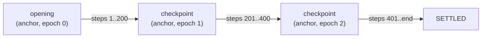

# Settlement and proofs

A game's result reaches the chain as a **history from the anchor**, or from
the dispute candidate to extend it. The channel recomputes it, by replaying the
steps itself or by verifying a proof of that replay, and never accepts a state
on the players' word. This page covers the two paths, approvals, checkpoints,
segments and what proofs cost.

## Two paths, one check

| | `submit_history` | Native proof |
| --- | --- | --- |
| Who runs the replay | The channel, onchain | The proof adapter's `__execute__`, in the virtual OS, proved by a prover |
| What the chain checks | Every step, the final signatures, and the referee's attestation if timed | The proof facts: OS program, base block, and the one transition message |
| Onchain cost | Grows with the number of steps | Roughly flat per proof (about 75M L2 gas of `gas_per_proof`) |
| Latency | One transaction | The state it starts from must be 10 blocks deep, plus proving time, plus one transaction |
| Needs | Nothing extra | A deployed, allowlisted adapter and a prover |

Both end in the same place: the channel's `receive`, with the end state and any
approvals.

## Approvals

A submission carries `acks`, one signature per seat:

- **All nonzero:** every seat signed `checkpoint_hash(context, epoch, state
  hash of end)`. The submission is **approved** and commits immediately. It is
  `SETTLED` if the game finished, and a **checkpoint** (the new anchor, `ACTIVE`)
  if not.
- **All zero:** the submission is **unapproved**. It becomes the dispute
  candidate if it outranks the current one, and opens a response window if the
  channel was `ACTIVE`. After the window, `resolve` commits the best candidate.
- **Mixed:** reverts.

Clients sign approvals with `session.checkpointSignature(epoch, privateKey)`.
The epoch is the channel's current epoch. An approval can't be reused after the
channel moves on.

## Checkpoints

A checkpoint commits an unfinished state as the new anchor. Later submissions
start from it, so a long game never replays from the opening:



A checkpoint's state becomes the next replay's `start`, together with its
witness if the game has one: `session.witness()`, or `rebase(session,
anchorHash)`, which rebuilds both from a longer session.

## Segments

Without approvals, a history too long for one submission settles as a chain of
**segments** within one dispute window. A submission may start from the anchor
or from the current candidate, so each segment extends the one before:

1. The first segment starts at the anchor. It becomes the candidate and opens
   the dispute.
2. Each next segment starts at the candidate and must outrank it.
3. Once the finished segment is the candidate and the window has passed,
   `resolve` settles the game.

`disputeAnswer(session, channel, { maxSteps })` in `@referee/sdk` builds the
next segment: the session rebased on the channel's candidate when its history
holds it, otherwise on the anchor, cut to `maxSteps` steps, or `null` when
nothing there outranks the candidate. A keeper settles long games this way,
with segments of at most `proof_max_steps` steps through a prover, or
`replay_max_steps` through `submit_history`.

## Proving strategy

- **Whole game in one proof when it fits.** Final-signature authentication and
  transcript binding keep traces small. Surround's 311-action game is 1.57M
  trace instructions, and games of up to 529 steps have been proved in one
  `PROOF1`.
- **Segments otherwise.** Each proof covers a segment. With every seat's
  approval it commits as a checkpoint; without, it extends the dispute
  candidate. This works with `PROOF1` today. `PROOF2`, the large path, only
  reduces how many segments are needed.
- **No per-move recursive proving.** STARK proof size barely grows with trace
  length: Surround's 68-action proof is 233 KB and its 311-action proof is about
  251 KB. Verification is a roughly flat charge per proof, so a recursive chain
  would end with a proof of about the same size and cost, while every link paid
  to verify the previous one inside Cairo.
- **Aggregation across games** is the recursion that would pay: many settled
  games per proof, spreading the fixed charge. It is a later optimization.

## What a proof commits to

The adapter's `__execute__` emits exactly one L2→L1 message:

```text
[adapter class, TAG, 'REFEREE_PROVED_V1', chain id, adapter, channel, game id,
 context, epoch, start state hash, end state hash]
```

The start state hash is the channel's anchor or its candidate. The adapter's
`settle(channel, game_id, epoch, start_hash, end, acks)` names it, and requires
the proof's facts to carry exactly the hash of that message, recomputed for
this adapter, game and epoch. The proof must also:

- be `PROOF1` or `PROOF2` of the virtual OS program the adapter pinned;
- be based on a block at or after the block that set its start state: the
  channel's `anchor_block`, or its `candidate_block` for a proof that extends
  the candidate;
- be at most 4000 blocks old.

A proof can't be moved to another game, epoch, adapter or chain, and it can't
settle a state reached from anything but the anchor or the candidate.

## Who settles

Anyone. `submit_history` and `resolve` are open to all callers, and so are a
timed game's `acknowledge` and `resume_by_referee`, which carry the referee's
signature. So are `roll` and `void`, for forced play that waits for the
referee's roll: `roll` posts the referee's value, and `void` ends the game
with no result (see
[The channel and disputes](/concepts/channel#a-roll-that-waits-for-the-referee)).
The adapter's
`settle` checks the proof, not the caller, and the channel accepts
`accept_verified` only from the game's own adapter. Players settle their own
games. A [keeper](/infra/keeper) settles finished games that nobody submitted,
and answers disputes, from its own account.
