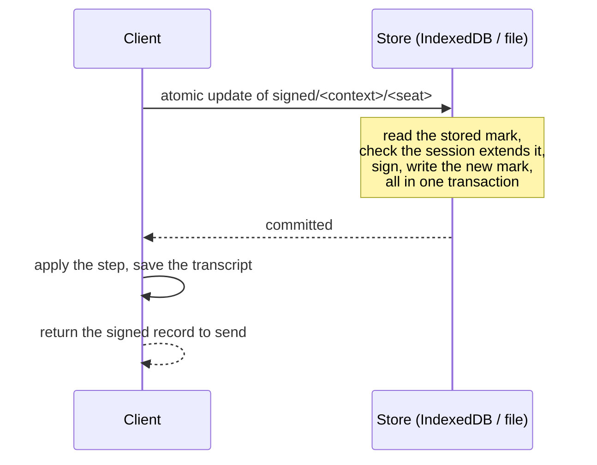

# Signing safety

A seat must never sign two different steps at the same position. Doing so is
**equivocation**: the other seat then holds signatures for two branches and can
extend and settle whichever suits it. An honest client can equivocate by
accident. This page explains how, and how `Session` and `SessionStore` prevent
it.

## How an honest client equivocates

Every step message binds `(context, seq, transcript)`. Signing a different step
from the same position produces a second valid signature for that seq. It
happens when a client signs from a copy of the game older than what it already
signed:

- **A stale restore.** The client crashed after sending a step but before
  saving it, or restored an old backup, and signs again from the earlier state.
- **Two tabs.** Both load the game at seq 5, and each signs a different move.
- **A new device.** It restores the game from a copy that's missing the last
  step this key signed, for example from a keeper that withheld it.

The chain can't tell which branch the seat meant. Both carry valid signatures.

## The mark

`Session.lastSigned[seat]` is the record of the last step this client signed
for that seat: `{ seq, transcript, message, step, signature, seat }`. `sign` (and so
`move`) refuses to sign unless the session's history includes that step:

| The session is… | Signing is… |
| --- | --- |
| At the mark's seq, same transcript | Allowed only for the **identical** step, which re-signs to the same signature |
| Past the mark, and its history contains the marked step | Allowed |
| Past the mark, on a history without the marked step | Refused: `Would equivocate: this key signed a different step at seq N` |
| Behind the mark | Refused: `Session is behind seq N, which this key signed` |
| Past the mark, where the referee's step took the marked step's position | Allowed (timed games): see below |
| Starting after the mark (a later anchor) | Allowed: the committed anchor supersedes it |

In a timed game the referee may append a step of its own, a `start`, at the
seq where the seat's unstamped step waited. That step then never enters the
history, and the seat has to sign its move again at the next seq. The guard
allows it: the lost step was never stamped, and a timed replay needs the
referee's attestation, so no branch through it can settle.

Marks are opt-in state. A `Session` with no marks behaves as if it has never
signed, which is what tests that build forks on purpose want.

## Where marks must live

A mark kept inside the session protects nothing against a stale session,
because the stale copy carries the stale mark. Marks have to be stored **apart
from transcripts**, and updated **before** a signature leaves the client.
`SessionStore.move` does both:

- The check, the signature and the new mark are **one atomic update**. In
  IndexedDB that's one readwrite transaction, so two tabs of one origin can't
  both sign at one seq.
- The mark is durable before `move` returns. The signature can't have left the
  client unless its mark was saved.
- Transcripts and marks are stored under different keys. Restoring an old
  transcript, from a backup, the other seat or a keeper, never rolls a mark back.
- If the client crashes between saving the mark and saving the transcript,
  `load` finds the mark just past the stored transcript and re-applies the
  marked step.

In a timed game, `move` marks and signs but doesn't apply the step, because it
needs the referee's stamp first. The step joins `session.pending`, and the seat
can sign the rest of its turn from there. The mark keeps the whole pending
chain, so `load` puts it back in `pending` for the client to resend
(`KeeperClient.submit`) instead of re-applying it. A different step landing
first at a pending step's seq (a flag, a start, or the other seat resigning)
drops the chain. A failed write discards the step it signed, so that signature
never leaves.

## Keys and marks

| | Session key | Mark |
| --- | --- | --- |
| What | The private key that signs this game's moves | The record of the last step that key signed |
| Secret | Yes | No: it's a step already sent to the other seat |
| Changes | Written once, before joining (`saveKey`) | On every move, before the signature leaves |
| Needs | Confidentiality | Freshness: it must never go backwards |
| If lost | You can't move | You can sign something that contradicts what you signed |
| Stored at | `key/<public key>` | `signed/<context>/<seat>` |

The key is the pen and the mark is the logbook. **They have to move together.**
A key without its latest mark can sign anywhere, including at a position it
already signed.

:::warning
**Use a key on one device at a time.** Two stores holding the same key don't
share marks, so each can sign at a position the other already signed. To switch
devices, move the key **and** its marks, and stop using the old copy. Restoring
only the transcript (for example with `keeper.load`) and the key is exactly the
new-device case above.
:::

The file backend locks its directory to one process (a `LOCK` file with the
process id), so two server processes can't share a store by mistake.

## What's left to the operator

The guard covers one store. It can't stop the same key being used from two
stores that never talk to each other, and it can't recover a mark that was
never copied. Those are operational rules: one device per key, and keys move
with their marks.
