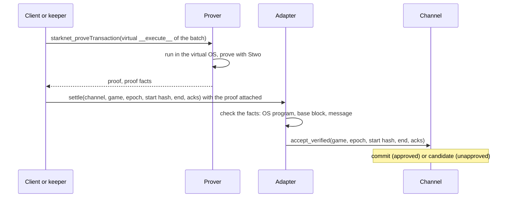

# Add a proof adapter

A proof adapter lets a game settle any length of history in one transaction
with a roughly flat onchain cost. Instead of replaying every step onchain
(`submit_history`), a prover proves the replay and the chain verifies the
proof. Surround settles whole games of several hundred steps this way on
Sepolia, one proof per game.

The adapter is optional. Without one, games settle through `submit_history`,
whose gas grows with the number of steps.

## How it works

The adapter is an **account contract** with two entrypoints:

- **`__execute__` (virtual).** A zero-fee `INVOKE_V3` that is never broadcast.
  It reads the channel's `snapshot`, checks that the batch starts from the
  anchor or from the dispute candidate (or, for a game no channel has opened
  yet, takes the game's terms and starts from their opening state at epoch 0),
  replays it with your rules against the final signatures (and, in a
  timed game, the referee's attestation), and emits one L2→L1 message: the
  adapter's class, the game's `TAG`, `'ARBITER_PROVED_V1'`, the chain, the
  adapter, the channel, the game, the context, the epoch, and the start and end
  state hashes. A prover runs this transaction in Starknet's virtual OS and
  proves it.
- **`settle` (real).** A transaction that carries the proof. Starknet verifies
  the proof and exposes its *facts*. `settle` checks them:
  - the proof is `PROOF1` or `PROOF2` of the virtual OS program the adapter
    pinned at deployment;
  - its base block is at or after the block that set the start state (the
    channel's `anchor_block`, or its `candidate_block` for a proof that extends
    the candidate), and at most 4000 blocks old. A proof from the epoch-0
    anchor, the opening state, is exempt from the first rule: the terms fix
    that state, so a proof based before the game opened settles in the same
    transaction as `open_game`;
  - it proves exactly one message, the expected transition for this game and
    epoch.

  It then calls the channel's `accept_verified` with the end state and any
  checkpoint approvals.



The channel accepts `accept_verified` only from the game's own prover, the
adapter address named in the terms. The adapter class must also be allowlisted
by a namespace owner.

## Write it

The adapter needs Cairo 2.18 and depends on `arbiter_adapter` and your rules
crate:

```toml
[package]
name = "my_game_adapter"
edition = "2024_07"
cairo-version = "=2.18.0"

[dependencies]
arbiter = { git = "https://github.com/broody/arbiter.git", rev = "<commit>" }
arbiter_adapter = { git = "https://github.com/broody/arbiter.git", rev = "<commit>" }
my_game = { path = "../rules" }
starknet = "=2.18.0"

[[target.starknet-contract]]
casm = true
```

The counter's adapter is about 40 lines of forwarding
([`adapter/examples/counter/src/lib.cairo`](https://github.com/broody/arbiter/blob/main/adapter/examples/counter/src/lib.cairo)):

```cairo
#[starknet::contract(account)]
pub mod CounterProver {
    use arbiter::{Batch, Envelope, Signature, Terms};
    use arbiter_adapter::prover;
    use arbiter_counter::{Action, Config, Counter, CounterRules};
    use starknet::storage::{StoragePointerReadAccess, StoragePointerWriteAccess};
    use starknet::{ContractAddress, VALIDATED};

    // No admin, upgrade path, arbitrary calls or custody. The virtual OS
    // program is fixed at deployment; an OS upgrade needs a new instance.
    #[storage]
    struct Storage {
        os_program: felt252,
    }

    #[constructor]
    fn constructor(ref self: ContractState, os_program: felt252) {
        assert(os_program != 0, 'Zero OS program');
        self.os_program.write(os_program);
    }

    #[abi(embed_v0)]
    impl ProverImpl of super::ICounterProver<ContractState> {
        fn settle(
            ref self: ContractState, channel: ContractAddress, game_id: felt252, epoch: u32,
            start_hash: felt252, end: Envelope<Counter>, acks: Span<Signature>,
        ) {
            prover::settle::<
                CounterRules,
            >(channel, game_id, epoch, start_hash, end, acks, self.os_program.read());
        }

        fn os_program(self: @ContractState) -> felt252 {
            self.os_program.read()
        }
    }

    #[abi(embed_v0)]
    impl VirtualImpl of super::IVirtualCounter<ContractState> {
        fn __validate__(
            self: @ContractState, channel: ContractAddress, game_id: felt252, epoch: u32,
            start: Envelope<Counter>, batch: Batch<Action>, opening: Option<Terms<Config>>,
        ) -> felt252 {
            prover::assert_virtual();
            VALIDATED
        }

        // `opening` is the terms of a game no channel has opened yet, `None` otherwise.
        fn __execute__(
            ref self: ContractState, channel: ContractAddress, game_id: felt252, epoch: u32,
            start: Envelope<Counter>, batch: Batch<Action>, opening: Option<Terms<Config>>,
        ) {
            prover::execute::<CounterRules>(channel, game_id, epoch, start, (), batch, opening);
        }
    }
}
```

- `assert_virtual` admits only a zero-fee `INVOKE_V3` with no caller, so the
  proving path can't run as a real transaction.
- A game with a witness adds a `witness` argument after `start` in both
  `__validate__` and `__execute__`, and passes it to `prover::execute`. The JS
  proving client builds calldata in that order.
- `opening` comes last: `Some(terms)` for a game no channel has opened yet,
  which the proof replays from `open(terms)` without reading the channel, and
  `None` otherwise. The terms must name this channel, game, chain and adapter.
- `settle` takes `start_hash`, the state the proof starts from: the channel's
  anchor, or its candidate for a proof that extends it. The adapter checks it
  against the channel's `snapshot` and passes it to `accept_verified`.
- The adapter holds nothing and can call nothing but the channel. It has no
  admin and no upgrade path.

## Deploy it

:::steps

### Declare and deploy one instance per OS program

The constructor pins the virtual OS program that proofs must attest. The SDK
exports the current one as `VIRTUAL_OS_PROGRAM` (Starknet v0.14.4). A network OS
upgrade needs a new adapter instance, and games whose terms are signed after it
name the new address.

### Allowlist the class in your channel

```bash
sozo execute <namespace>-channel allow_prover <ADAPTER_CLASS_HASH> 1
```

### Name the adapter in the terms

The terms' `prover` is the adapter's address. The seats sign it with the rest
of the terms, and the channel accepts proofs only from it.

:::

## Prove and settle from JS

`proveSession` in `@arbiter/sdk/proving` does the whole client side:

```js
import { proveSession } from '@arbiter/sdk/proving'
import { rebase } from '@arbiter/sdk'

// The session must start at the channel's current anchor (or its candidate, to extend it).
const base = rebase(session, anchorHash)
const proved = await proveSession({
  rpcUrl, proverUrl, session: base, epoch, expectedClassHash: ADAPTER_CLASS_HASH,
})
// Send `settle` from any account, with the proof attached to the transaction.
const acks = [aliceCheckpoint, bobCheckpoint]   // or omit for a dispute candidate
await account.execute(proved.call(acks), { ...proved.options })
```

A game nobody opened yet is proved from its terms, at epoch 0, and
`proveSession` says so with `opening: true`. Open it in the same transaction:

```js
import { openGameCall, proveSession } from '@arbiter/sdk/proving'

const proved = await proveSession({ rpcUrl, proverUrl, session, epoch: 0, expectedClassHash: ADAPTER_CLASS_HASH })
await account.execute([openGameCall(counter, terms, signatures), proved.call(acks)], { ...proved.options })
```

Before it asks the prover for anything, `proveSession`:

1. waits (up to `waitMs`) until the state the session starts from, the anchor
   or the candidate, was set 10 blocks deep, the minimum depth for a proof's
   base block (`NATIVE_CONFIRMATIONS`);
2. checks at the base block that the epoch is current, the session starts at
   the chain's anchor or candidate (or, for a game nobody opened, at its
   terms' opening state), and the adapter's class is the one you expect;
3. replays the session with every signature verified.

It then sends the adapter's virtual transaction to a `starknet_proveTransaction`
endpoint, and checks that the response proves exactly the transition it asked
for. The prover can be StarkWare's hosted prover, or your own
([Prover](/infra/prover)).

:::warning
Estimate and send `settle` through an RPC node whose versioned constants match
the sequencer's. A node on older constants may reject a valid `PROOF1` in
simulation that the sequencer would accept.
:::

A keeper configured with a `prover` does all of this for you when it answers a
dispute or settles a long game, in segments of up to its `proof_max_steps`
steps. See [Keeper](/infra/keeper).
