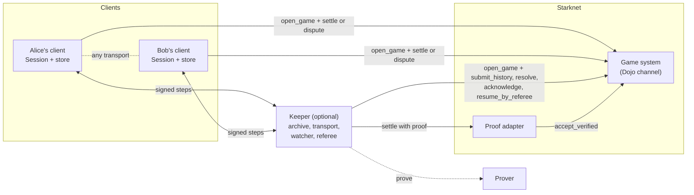
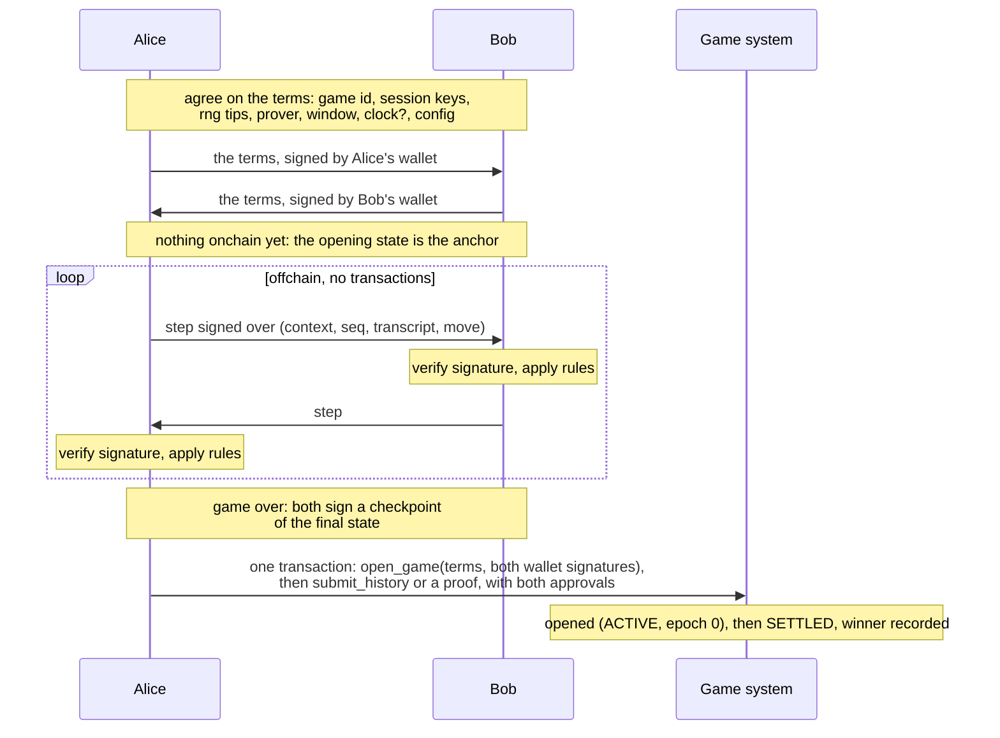
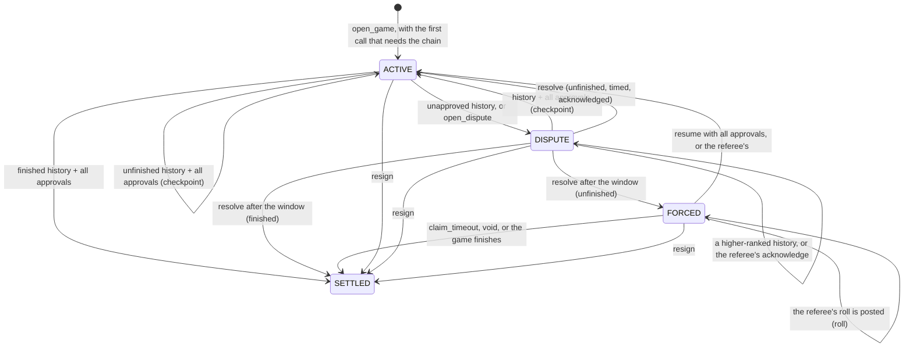
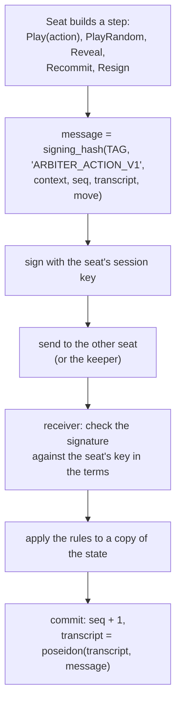

# How it works

This page follows one game from its signed terms to settlement, then shows
what happens when a player stops cooperating. Each part links to a page with the details.

## The pieces

- **Clients** each hold a `Session`: their own verified copy of the game. They
  sign their moves with a per-game session key and check every move they
  receive against the rules.
- **The game system** is your Dojo contract. It stores each game's channel: who
  plays, the committed state (the *anchor*), and the dispute status. It stores
  hashes, not transcripts.
- **The proof adapter** is a small account contract. A prover proves a replay
  that the adapter runs, and `settle` hands the proved result to the channel.
- **The keeper** is optional infrastructure. It stores and forwards steps, and
  it can answer disputes and settle for players who are offline. It can also
  keep time as the referee of timed games, and give them their randomness.

## A game, start to finish

:::steps

### Agree (offchain)

Alice and Bob agree on the game's **terms**, and each signs them with their
wallet. For each seat, the terms carry:

- a **session key**, a fresh key that signs moves in this game only;
- the tip of a **hash chain**, which will supply randomness.

They also name the chain, the contract, a game id the players choose, the
prover, the response window, an optional clock, the wallets and the game
config. Their hash is the **context**, and every signature in the game
includes it. Nothing goes onchain: the signed terms are the game, and its
opening state is the first **anchor**.

### Play (offchain)

A move is a **step**. The seat whose turn it is signs a message that binds the
context, the step's position (`seq`), the **transcript** (a hash chain of every
earlier step's message) and the move itself. The other client checks the
signature, runs the rules, and appends the step. No transaction happens.

Because every signature covers the transcript, history can't be reordered or
edited later. The two clients can exchange steps over any transport: a keeper,
a WebSocket or a peer-to-peer link.

### Settle (onchain)

When the game ends, both players sign a **checkpoint** approval of the final
state. Anyone submits the history from the anchor, together with both approvals.
If nobody has opened the game yet, the same transaction opens it first:
`open_game` takes the terms and both wallet signatures, asks each wallet's
account whether it signed them, and commits the opening state.
Every game ends: your rules bound its length, and the protocol caps every
transcript at your `max_steps`.
It goes through one of two paths:

- **`submit_history`**: the channel replays the steps onchain against each
  seat's last signature;
- **a native proof**: a prover proves the same replay, and the adapter's `settle`
  submits the result.

With both approvals the game opens and settles in one transaction. The same
flow with an unfinished state is a checkpoint: it becomes the new anchor, and
play goes on from there.

:::

## When a player stops cooperating

Signatures alone never commit a state. A state commits only if it was replayed
or proved from the anchor (or from a dispute candidate that was), so two
colluding accounts cannot sign a fake result into existence. When approvals are missing, the channel falls back to a
**dispute window** (5 minutes to 7 days, set in the terms):

| Situation | What happens |
| --- | --- |
| **Won't approve the result** | Submit the history without approvals. It becomes the *candidate* and opens a dispute. If nobody submits a higher-ranked history before the window closes, anyone calls `resolve` and the game settles. |
| **Submits an old state** | During the window, the other player (or a keeper) submits the newer history. Candidates rank by `support_turn` (how many times the signing seat changed), then `seq`, so a player can't win by stopping before the opponent's last move. |
| **Stalls** | In a timed game, the referee flags the staller once its time runs out. Otherwise, open a dispute, opening the game in the same transaction if nobody has. If the window passes with the game unfinished, `resolve` moves it to **forced play**: the due seat must move onchain within each window, or the other seat claims the game on timeout. A live referee keeps a timed game's disputes out of forced play. |
| **Gives up** | Either player resigns at any time, with a signed `Resign` step or a wallet call. |
| **The referee is down while a roll waits for it** | Only in a game that takes its randomness from its referee. Forced play pauses for up to 3 days, and nobody can be timed out meanwhile. Anyone can post the referee's value (`roll`). Otherwise the game ends **void**, with no result: at once if both players agree, or by anyone after the pause. |

Details: [The channel and disputes](/concepts/channel).

## Who checks what

| Where | What is verified |
| --- | --- |
| Each client (`Session.receive`) | Every signature, every step against the rules, and in a timed game every stamp. Clients never sign from a state they haven't fully verified. |
| The channel (`open_game`) | Every seat's wallet signature over the terms, asked of its account (`is_valid_signature`), and the terms themselves: this chain and contract, a game id never opened, distinct keys and tips, an allowlisted prover. |
| The channel (`submit_history`) | A replay from the committed anchor, or from the dispute candidate, against **each seat's final signature**. That signature covers every earlier step through the transcript. |
| The adapter (`settle`) | Network-verified proof facts: the right virtual OS program, a recent base block, and exactly the expected start → end transition, from the anchor or the candidate. |
| The keeper | The same as a client, before it stores or forwards anything. |

## The life of a step

The seat is never part of the step. The state says whose turn it is, so only
`Resign`, which either seat may send, names its seat. Details:
[Steps and transcripts](/concepts/protocol).

## Optional pieces

- **Randomness.** When an action needs dice, the acting seat attaches its next
  hash-chain value and the other seat reveals theirs. The roll is a hash of
  both, so neither can predict or bias it. A timed game can take its rolls from
  its referee instead, so no seat has to be online to reveal. See
  [Randomness](/concepts/randomness).
- **Clocks.** A game can name a **referee** in its terms: a third key that
  stamps every step with the time, starts the clock and flags a seat whose time
  runs out. Players sign moves; the referee signs time. See
  [Clocks and the referee](/concepts/clocks).
- **A keeper** stores transcripts so players can refresh or switch devices,
  forwards steps between seats, answers disputes for offline players and settles
  finished games. See [Keeper](/infra/keeper).
