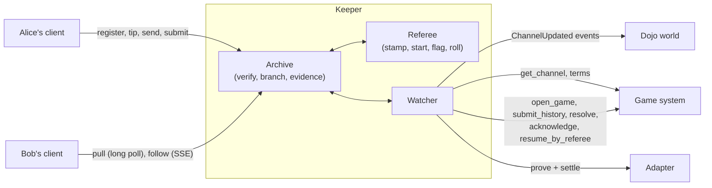

# Keeper

A keeper keeps arbiter games moving when players can't or won't. It's one
service over one piece of state, the latest verified transcript of each game:

| Part | What it does |
| --- | --- |
| **Archive** | Keeps each game's signed transcript, verified step by step, in a file store |
| **Transport** | Forwards steps between the seats: clients send theirs and long-poll for the other's, or follow a stream of server-sent events. A player who refreshes, switches device or comes back online restores the game from here |
| **Watcher** | Reads each open game's channel. It answers disputes once, resolves expired ones and settles finished games, in segments when long, from the keeper's own account. A finished game nobody opened yet opens in the transaction that settles it |
| **Referee** (optional) | With a referee key, it registers the timed games that open onchain naming that key, stamps their steps, starts their clocks, flags a seat whose time runs out, acknowledges their disputes and returns them from forced play. With a randomness secret too, it gives the games that ask their randomness |



Clients use it through `@arbiter/sdk/keeper` (see
[Build the client](/guide/client) and the
[client reference](/reference/keeper-client)). The HTTP API is in the
[reference](/reference/keeper-api).

## What it can and can't do

- It can't forge a step: it keeps only steps whose signatures verify, and
  every client verifies again whatever it pulls.
- It can delay or withhold steps. Both players keep their own copies
  (`@arbiter/sdk/store`), so it's never the only copy.
- It holds no player keys. Its account pays for `submit_history`, `resolve`
  and the adapter's `settle`, which anyone may send, with `open_game` on the
  seats' own wallet signatures for a game nobody opened yet; for its
  referee's `acknowledge` and `resume_by_referee`; and for the calls a game's
  `afterSettle` hook adds.
- As a referee, it's trusted with time in the games that name it (see
  [Clocks and the referee](/concepts/clocks)), and with the rolls of the games
  that take their randomness from it: it can't bias a roll, but it knows its
  own next value ahead of time, and players trust it not to leak it (see
  [Randomness](/concepts/randomness#randomness-from-the-referee)).
- Anyone can run one, and a game can use several.

It needs no indexer. It watches the games clients register, and, as a referee
with a `world` configured, the games that open naming its key, which it finds
in the world's events through its RPC node. It reads each open game's current
state with one `get_channel` call per round. The chain stores hashes, and the
histories behind them are in the archive.

## Archive

- **Admission.** A registered game must be on a configured channel and chain,
  and pass `Session.import`. A game a channel holds must match the context
  the channel stores onchain, which binds every term. A game no channel holds
  comes with each seat's wallet signature over its terms instead (see
  [Games no channel holds](#games-no-channel-holds)). Either way nobody can
  squat a game id with other terms. Its codec's `maxSteps(config) + 1`, the
  longest transcript the protocol allows it, must fit the entry's
  `max_steps`.
- **Branches.** Steps that overlap the archive are checked position by position.
  When a step differs from the stored one, the other branch replaces the
  archive only if it ranks higher, as the channel ranks dispute candidates.
  Otherwise the keeper answers 409 with the stored step. A client whose history
  diverged is told so by `pull` or `follow`, and a client still on the shared
  prefix just follows the stored branch.
- **Equivocation.** Two different steps signed by one seat at the same seq are
  stored as evidence, with both messages and signatures (`GET …/evidence`).
- **Re-anchoring.** A session starting at a later anchor inside the stored
  history is merged. A disjoint one, for example after forced play onchain,
  replaces the archive only if it starts at the channel's current anchor.
- **Closed games.** A game closes when its channel is `SETTLED`. A game no
  channel holds closes when it sits idle, and an unanchored one also when it
  finishes. A closed game leaves memory and stays on disk, readable. It takes
  no more steps.

## Capacity

At most `max_open_games` games are open at once; closed games don't count.
The last `reserved_games` slots go only to games that the entry's `admit` hook
ranks above 0, so a game a matchmaker paired can't be crowded out. Surround,
for instance, ranks rated games first. A full keeper answers 503.

`GET /info` reports `capacity`: `open`, `free`, and `free_unreserved`, the
free slots a game without priority can use. A matchmaker checks it before it
pairs a game here.

## Games no channel holds

A game opens onchain only when it first needs the chain, usually to settle
(see [How it works](/how-it-works)). Until then no channel holds it, and the
keeper admits it on its seats' wallet signatures instead:

1. Each seat's wallet signs the terms: `termsTypedData(game, terms)` in
   [`@arbiter/sdk`](/reference/sdk), SNIP-12 typed data naming the game and
   its terms' context.
2. The client registers the game with the signatures in seat order
   (`register(session, { authorizations })`).
3. The keeper asks each seat's account contract whether it accepts the
   signature (`isValidSignature` or `is_valid_signature`, through `rpc_url`),
   and keeps the signatures with the game.

The context binds every term, session keys included, so the signatures bind
each wallet to its key, as `open_game` checks onchain. Clients pick random
game ids. There are two kinds of such games:

- **Not opened yet.** A game on a real channel: the usual case. It must start
  at its opening. The watcher leaves it alone until it is finished, then opens
  it with these signatures in the transaction that settles it (see
  [Watcher](#watcher)). A seat that needs the chain sooner, for a dispute,
  opens the game in its own transaction. Once a channel holds the game, it
  runs like any other.
- **Unanchored.** A game entry with `anchored: false` keeps games that never
  touch the chain, such as free casual ones. The terms name the entry's
  `channel` value, which is no real channel, so their signatures can never
  settle anywhere, and the watcher leaves them alone.

These games cost their players nothing until they open, so:

- each wallet plays at most `max_open_per_player` of them here, of both kinds
  together (429 beyond);
- one closes after `unanchored_ttl_seconds` without a step, and an unanchored
  game also once finished. A finished game waiting to open never closes: it
  waits to settle.

A game stops counting against the cap once a channel holds it: an open game
has no per-wallet cap.

## Referee

A keeper started with a referee key referees every timed game whose terms name
that key (`clock.referee`):

| When | Referee |
| --- | --- |
| A timed game opens onchain | With `world` and `namespace` on the entry, the watcher finds the opening in the world's `ChannelUpdated` events (`OPENED`), reads the game's terms (`terms`), and registers it from its opening state if it names this key. The game has a referee even if no seat registers it. A game usually opens only to settle or to be disputed, though, so a seat or a matchmaker registers a timed game to have it refereed while it is played |
| A step arrives unstamped | Stamps it, before it is archived and forwarded. A step that arrives after its seat's time ran out is refused (`Flag fell`), and the seat is flagged |
| No first step within `start_grace_seconds` | Appends a `start`, and the due seat's clock runs from there. A running clock is never restarted |
| The due seat's time runs out | A timer appends the referee's `flag`. The watcher then settles the game like any finished one |
| A dispute opens on an unfinished candidate | The watcher sends `acknowledge` at once, so the game returns to play after the window instead of forced play (see [Watcher](#watcher)) |
| The channel is in forced play | Stamps nothing and flags no one. The watcher sends `resume_by_referee` |
| The channel is back in play | Restarts the clock once: from the last stamp when a seat's step comes first, otherwise with a `start` after the start grace. The forced period is charged to no one |
| The transcript reaches the entry's `max_steps` | Stops refereeing the game: a seat whose step the cap refuses is never flagged |

It never stamps a second step at one seq. A seat that signs another step there
is recorded as equivocating, and nothing is stamped. On start it loads every
open game it referees and resumes each clock at its last stamp, so seats are
not charged for the keeper's downtime.

A keeper that is not a game's referee archives and forwards only stamped
steps, and settles and answers disputes as usual.

### Randomness

A referee started with a randomness secret (`referee.rng_secret_env`) also
gives a timed game its rolls, when the game's terms carry the tip of the
keeper's hash chain (`clock.rng_tip`). No seat then has to be online to reveal.
See [Randomness](/concepts/randomness#randomness-from-the-referee).

| When | Keeper |
| --- | --- |
| A client asks for a game's tip (`POST …/tip`) | Answers `{ rng_tip, signature }`: the tip of its chain for that game, and the referee's signature over it for that game alone. Clients ask before the seats sign the terms, with the game's `config`. For a game a channel already holds, it reads the config from the channel, and answers only if the terms ask this referee for randomness. The same game always gets the same tip |
| A game registers naming its key and a randomness tip | Refuses it (409) unless the tip is the tip of its own chain for that game: it could not roll for it |
| It stamps a step that asks for randomness | Appends its roll at once: its next chain value, with the same stamp. The roll charges no one, and no flag falls while a roll is pending |
| It starts with a roll pending | Answers the roll it owed when it stopped, stamped where the clock stopped |
| A seat asked for a roll onchain, in forced play | Rolls once the channel is back in play and the archive holds that state, which the watcher reads back from the chain if the keeper did not see it. The `start` still follows the start grace |

Each chain comes from the secret and the game's ids (chain, channel and game
id), so the keeper stores nothing and rebuilds the same chain after a restart.
A chain has a value for every roll the game's `maxSteps(config)` allows.

The keeper posts no roll onchain. During forced play it returns the game to
offchain play with `resume_by_referee` and rolls there. The channel's `roll`
takes the value from anyone who knows it, and anyone can end a game void once
its roll has waited 3 days (see
[The channel and disputes](/concepts/channel#a-roll-that-waits-for-the-referee)).

## Watcher

Every `poll_seconds`, the watcher first registers the timed games that opened
naming its referee key, on the entries with a `world`. A registration that
fails for a reason that may pass, such as an RPC error or a full keeper, is
kept in the store and retried each round until the game registers or the
archive refuses it. Then, for each open anchored game:

| Channel | Keeper |
| --- | --- |
| None yet, stored game finished | Opens the game and submits it in one transaction: `open_game` on the seats' wallet signatures, with its own signature over the tip when it gives the game its randomness, then the first segment from the opening. The game then runs like any other |
| None yet, unfinished | Waits. The keeper never opens a game to dispute it: a seat does, in its own transaction |
| `ACTIVE`, stored game finished | Submits it, as the first segment if it is long. Without approvals it becomes the candidate, and is resolved after the window |
| `DISPUTE`, stored game finished | Submits the next segment, extending the candidate, if any |
| `DISPUTE`, a timed game it referees, candidate unfinished | Sends `acknowledge` at once, unless the channel holds it already |
| `DISPUTE`, other games | Answers once, `answer_margin_seconds` before the deadline, with what outranks the candidate, extending it when its history holds it (`disputeAnswer`). Again only against a newer candidate someone else submits |
| `DISPUTE`, window passed | `resolve`, with the game's `afterSettle` calls when it settles the game |
| `FORCED`, a timed game it referees | `resume_by_referee`, once, when the archive holds the anchor and the forced-play window is open. While a roll waits for the referee, that window is the 3-day pause. If the archive lacks the anchor, the watcher first follows the forced play from the chain: the `force` and `roll` calls in the transactions' traces, back to a state it holds, replayed and checked against the channel's states. That needs `world` and `namespace` on the entry and `decodeAction` in the game's codec |
| `FORCED`, other games | Waits: forced moves and timeouts need a player's wallet |
| `SETTLED` | Closes the game |

A referee whose acknowledgement isn't onchain by `answer_margin_seconds`
before the deadline answers as for other games, so forced play would start
from the latest attested state, not a stale anchor. No submission is repeated
each round.

**Segments.** A submission holds at most `replay_max_steps` steps (default
64), or with a `prover` up to `proof_max_steps`. A longer finished transcript
settles as a chain of segments within one dispute window:

1. The first segment, from the channel's anchor, opens the dispute.
2. Each next one starts from the candidate and extends it, one per round.
3. The finished one lets `resolve` settle the game once the window passes.

A segment of up to `replay_max_steps` steps goes through `submit_history`, an
onchain replay. A longer one is proved through the game's `prover` (see
[Prover](/infra/prover)) and settled with the adapter. For a game nobody
opened, the first segment goes after `open_game` in the same transaction, and
a proof of it is proved from the game's terms.

**After settling.** When the keeper's `resolve` settles a game, it adds the
calls the entry's `afterSettle` hook returns, such as Surround's `rate`, in
the same transaction when a simulation of the bundle succeeds, and otherwise
in a second one.

Transactions go out one at a time, since they share the account's nonce, and
each fee bound is checked against `max_fee_fri`. Without an `account`, the
keeper only watches and logs what it would send.

## Run it

:::steps

### Write a config

Start from [`keeper/config.example.json`](https://github.com/broody/arbiter/blob/main/keeper/config.example.json):

```json
{
  "host": "127.0.0.1",
  "port": 3200,
  "store": "keeper-data",
  "chain_id": "SN_SEPOLIA",
  "rpc_url": "http://127.0.0.1:9545/rpc/v0_10",
  "poll_seconds": 15,
  "settle": true,
  "referee": { "private_key_env": "KEEPER_REFEREE_KEY", "rng_secret_env": "KEEPER_RNG_SECRET" },
  "account": { "address": "0x…", "private_key_env": "KEEPER_PRIVATE_KEY", "max_fee_fri": "50000000000000000000" },
  "games": [
    {
      "channel": "0x…",
      "module": "../sdk/examples/counter.mjs",
      "export": "counter",
      "max_steps": 4096,
      "replay_max_steps": 64,
      "proof_max_steps": 512,
      "start_grace_seconds": 120,
      "answer_margin_seconds": 600,
      "world": "0x…",
      "namespace": "counter",
      "prover": { "url": "http://127.0.0.1:3100", "class_hash": "0x…" }
    }
  ],
  "max_open_games": 10000,
  "reserved_games": 1000,
  "max_open_per_player": 4,
  "unanchored_ttl_seconds": 86400
}
```

- `games` has one entry per game system. `module` and `export` locate the game's
  JS codec (a relative path resolves from the config file). The codec needs
  `maxSteps`. Set the entry's `max_steps` from it: Go's bound is far below
  Hashfront's.
- `entrypoints` renames your system's calls (`get_channel`, `open_game`,
  `submit_history`, `resolve`, `acknowledge`, `resume_by_referee`, `terms`,
  `force`, `roll`): Surround's are
  `resolve_dispute` and `get_channel`. The system must expose
  `get_channel(game_id) -> ChannelGame`.
- `anchored: false` makes an entry for [unanchored games](#games-no-channel-holds).
  Its `channel` is then any value the terms name, `0x0` for instance, and it
  takes no `prover`.
- `prover` is optional. Without it, every segment is an onchain replay of at
  most `replay_max_steps` steps.
- `world` and `namespace` let a referee register opened games itself, and
  follow forced play it did not see.
  Scanning starts at `from_block`, or at the chain's head the first time, and
  resumes where it stopped.
- `account` is optional. Without it the keeper only watches. Keys come from
  environment variables, never from the file.
- `referee` is optional. Without it the keeper referees nothing. Its
  `rng_secret_env` names the environment variable that holds the referee's
  randomness secret, a felt. Without it the keeper gives no randomness, and
  refuses the games that would need it.
- `settle: false` stops the keeper from submitting finished games itself.
- The old names `max_games` and `max_history_steps` still work.

Every key and default is in [Config](/reference/keeper-api#config).

### Add hooks (optional)

The game's module may export, next to its codec, `admit(ids, terms, { provider })`,
a new game's priority for the reserved slots,
`afterSettle(ids, channel, { provider })`, the calls to send with the `resolve`
that settles a game, and `openCall(ids, terms, { signatures, refereeSignature, extras, provider })`,
the call that opens a game no channel holds yet when the channel's own
`open_game` won't do. See [Hooks](/reference/keeper-api#hooks).

### Start it

```bash
KEEPER_PRIVATE_KEY=0x… KEEPER_REFEREE_KEY=0x… KEEPER_RNG_SECRET=0x… node keeper/server.mjs keeper/config.local.json
```

On start it checks that the RPC node is on `chain_id`. It then loads its store
and, as a referee, resumes each timed game's clock at its last stamp and
answers any roll it owed.

:::

:::warning
Use separate keys for the keeper's account and its referee, and a randomness
secret that is neither. Whoever holds the secret can compute the referee's
value for every roll ahead of time, so keep it private. Keep it unchanged
while games that use it are open: their chains come from it. Fund the account
for the transactions it sends, and cap them with `max_fee_fri`.
:::

## Operate it

- **Logs.** One JSON line per HTTP request; an event stream logs its line when
  it closes, with `stream: true`. One line per archive event, as `event`:
  `registered`, `reanchored`, `switched`, `equivocation`, `flagged`,
  `started`, `restarted`, `rolled`, `forced`, `resumed`, `unrefereed` and
  `evicted` (`reason`: `finished` or `idle`). A roll the referee could not
  give logs `roll` with `outcome: failed`. One line per chain action, as `action`:
  `settle`, `answer`, `acknowledge`, `resume`, `resolve`, `close` and
  `register`, with `outcome` (`sent`, `failed`, `skipped` without an account,
  `opened`, or `refused`: a registration the archive turned down, which,
  unlike a `failed` one, isn't retried) and `tx`.
- **Store.** A directory of JSON files (`@arbiter/sdk/store/file`). A `LOCK`
  file allows one process per directory. Closed games stay in it.
- **Limits.** `max_open_games`, `reserved_games`, `max_open_per_player` and
  `max_steps` bound storage, `rate_per_minute` and `max_body_bytes` bound
  POSTs, and `max_waiters` bounds long polls and event streams together.
  `heartbeat_seconds` (default 15) spaces the comment lines that keep proxies
  from closing an idle stream.
- **RPC.** Each round costs one `get_channel` call per open anchored game.
  With `world` set, it also scans the world's events from where it stopped,
  and reads the terms of each game that opened, again each round while its
  registration is retried. Admitting a game costs one `get_channel` call on an
  anchored entry and, for a game no channel holds, one signature check per
  seat, a call to its account contract. A tip for an anchored game costs one
  `get_channel` call. Use a node you control for
  many games.
- **Ports.** The default port, 3200, is also the prover gateway's default worker
  base port. Change one if both run on one host.

## Test it

- `node --test keeper/test/*.test.mjs`: the archive, the watcher, the referee,
  the step stream and the HTTP API against a fake chain, and the event and
  terms reads against a fake RPC provider. They cover unanchored games
  filling a wallet's cap, games nobody opened yet (held on their wallets'
  signatures, left alone until finished, then opened in the transaction that
  settles them), registration from `OPENED` events and its retries, answering
  a dispute once, the fallback when an acknowledgement doesn't land, starts
  after the start grace and after forced play, chained segments, no flag
  after a step the cap refused, and the referee's tips and rolls.
- `node keeper/bench.mjs [STEPS]`: the latency a referee adds, from the SDK
  work per step to a step's trip through a refereeing keeper to the other
  seat's stream, with the memory and the file store.
- `keeper/katana.sh`: starts Katana, deploys the counter world and runs real
  transactions. Every game opens on the Katana accounts' real SNIP-12
  signatures. Alice opens a game and disputes it in one transaction, and the
  keeper answers the stale dispute and resolves it into forced play. The
  keeper opens and settles three games nobody opened, each in the
  transaction that submits it: a finished game, a timed game it referees
  through a flag to `SETTLED`, and one it gives its randomness: the terms
  carry its signed tip, it rolls for a gamble, and the channel replays the
  roll. Last, it is stopped while a seat gambles onchain in forced play, and
  once restarted it follows the forced call, takes the game back and rolls.
  It needs Katana 1.7.1 and Sozo 1.8.0, and takes a minute or two.
