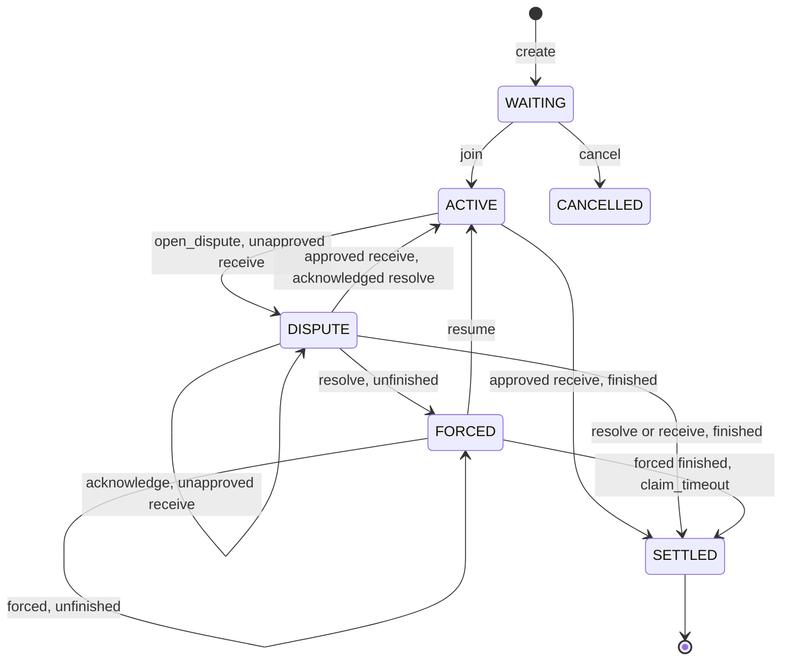

# Cairo: referee

The `referee` crate ([`core/`](https://github.com/broody/referee/blob/main/core/src/lib.cairo)) is the game-agnostic protocol: the `GameRules` trait, the envelope around a game's state, the hashes every signature covers, signed replay, time rules, and the channel state machine as pure functions. This page lists every public item, for game authors and for anyone writing a binding.

The crate has no Dojo or Starknet storage dependency. It declares `cairo-version = "2.13.1"` and builds on both Dojo's Cairo (2.13) and the proof adapter's (2.18). Crates in this repository depend on it by path:

```toml
[dependencies]
referee = { path = "../../core" }
```

| Module | Contents |
| --- | --- |
| `referee::rules` | `GameRules` |
| `referee::types` | Data types and seat, outcome and reason constants |
| `referee::protocol` | Hashes, signature checks, randomness, replay |
| `referee::clocks` | `ClockRules` and the standard time control |
| `referee::channel` | The channel state machine |

The crate root re-exports `GameRules`, every type and constant in `types`, `PROTOCOL_VERSION`, every public function in `protocol`, and `Channel`, `StateRef` and `state_ref` from `channel`. The channel's status constants and transition functions are reached through `referee::channel`, and everything in `clocks`, including `MAX_CLOCK_MS`, through `referee::clocks`.

## GameRules

What a game implements ([`rules.cairo`](https://github.com/broody/referee/blob/main/core/src/rules.cairo)). Every function must be deterministic and must panic on an illegal action. The same rules run in the Dojo channel's onchain replay and in the proving program. See [Write the rules](/guide/rules).

### Associated types

| Type | Contract |
| --- | --- |
| `Config` | Game-specific terms bound into the context (board size, map hash, ...). |
| `State` | The game's state. The protocol wraps it in an `Envelope`. |
| `Action` | A seat's game action, carried by `Move::Play` and `Move::PlayRandom`. |
| `Witness` | Extra replay input supplied as calldata (position history, map terrain). |
| `Scratch` | Working memory built from the witness, e.g. a `Felt252Dict`. |

### Constants

| Constant | Type | Contract |
| --- | --- | --- |
| `TAG` | `felt252` | Domain tag, e.g. `'SURROUND'`. It leads the context, state, action, checkpoint, reopen, live, referee resume, stamp and seed hashes, which keeps hashes of different games apart. |
| `RULES_VERSION` | `u32` | Bound into the context hash. |
| `SEATS` | `u8` | Number of seats. The protocol supports 2: `open` panics with `'Only 2 seats supported'` otherwise. |

### Time rules

| Item | Contract |
| --- | --- |
| `impl Time: ClockRules<Self::State>` | How the game's clocks run when it is timed, e.g. `referee::clocks::StandardTime<State>`. Every game names one; untimed games never call it. See [The clocks module](#the-clocks-module). |

### Functions

| Function | Contract |
| --- | --- |
| `init(config: @Config) -> State` | The opening state. `open` calls it, and `referee_dojo`'s `create` calls it to reject an invalid config up front. |
| `load(config: @Config, state: @State, witness: Witness) -> Scratch` | Check `witness` against `config` and `state`, and build scratch memory. Replay calls it once, with the start state. |
| `apply(config: @Config, ref scratch: Scratch, state: State, seat: u8, action: Action) -> (State, Option<u8>)` | Apply `seat`'s action. Returns the new state and, if the action needs shared randomness, the seat that must reveal before play continues. |
| `resolve(config: @Config, ref scratch: Scratch, state: State, seed: felt252) -> State` | Complete the pending randomness request with the agreed seed. Games that never request randomness can panic here. |
| `due(state: @State) -> u8` | The seat due to act. The protocol overrides it while a reveal is pending. In a timed game a turn ends when this value changes. |
| `outcome(state: @State) -> Option<(u8, u8)>` | `Some((winner, reason))` once the game is over. `winner` is seat + 1 or `DRAW`; `reason` is in `1..=127`. A game bounds its own length here (a move or round limit), so it always ends. |
| `max_steps(config: @Config) -> u32` | The most steps (`seq`) a transcript may hold. The protocol ends the game with `adjudicate` at the first step at or past it that leaves no reveal pending. It is a safety net for transcripts, proofs and archives, not the game's own limit: set it to at least the game's longest game times (1 + protocol steps per game action). |
| `adjudicate(config: @Config, state: @State) -> (u8, u8)` | `(winner, reason)` for a game stopped at `max_steps`, as `outcome` reports them. |

The protocol enforces part of this contract during replay: `Move::Play` panics with `'Randomness requested'` if `apply` returns a seat, `Move::PlayRandom` panics with `'Unexpected entropy'` if it returns `None` and with `'Invalid reveal seat'` if it names the acting seat or a seat `>= SEATS`, and a result from `outcome` or `adjudicate` panics with `'Invalid winner'` (`winner > SEATS`) or `'Invalid finish reason'` (`reason` outside `1..=127`).

## Types

Defined in [`types.cairo`](https://github.com/broody/referee/blob/main/core/src/types.cairo). Every struct and enum derives `Copy`, `Drop`, `Serde`, `PartialEq` and `Debug`.

### Constants

| Constant | Type | Value | Meaning |
| --- | --- | --- | --- |
| `NO_SEAT` | `u8` | `255` | `Envelope.last_seat` before any step has been applied. |
| `REFEREE` | `u8` | `254` | The actor of a `Flag` or a `Start`. The referee is not a seat. |
| `DRAW` | `u8` | `0` | `Outcome.winner` for a drawn game. Otherwise `winner` is the winning seat + 1. |
| `REASON_RESIGN` | `u8` | `128` | Finish reason of a resignation. |
| `REASON_TIMEOUT` | `u8` | `129` | Finish reason of the referee's `Flag`. |
| `REASON_ABANDON` | `u8` | `130` | Finish reason of `channel::claim_timeout`: the chain judged that the due seat missed its forced-play window, without any referee. |
| `PROTOCOL_VERSION` | `felt252` | `4` | Bound into the context hash. Version 4 added `Move::Start`, recommits only after a reveal, the transcript cap (`max_steps`) and disputes a live referee returns to offchain play. Version 3 added optional referee clocks; version 2 made steps seat-implicit `Move`s with one final signature per seat. |

Finish reasons `1..=127` are game-defined; the protocol reserves the rest. `PROTOCOL_VERSION` lives in `protocol`.

### Terms

`Terms<C>`: everything bound into a channel's context hash. Arrays are indexed by seat.

| Field | Type | Meaning |
| --- | --- | --- |
| `chain_id` | `felt252` | Starknet chain id. |
| `channel` | `felt252` | Address of the contract that holds the channel (the game system). |
| `game_id` | `felt252` | The game's id in that contract. |
| `prover` | `felt252` | Address of the proof adapter the game accepts. |
| `response_seconds` | `u32` | Length of a dispute or forced-play window. |
| `clock` | `Option<TimeControl>` | The time control, or `None` for an untimed game. |
| `players` | `Span<felt252>` | Wallet addresses. |
| `keys` | `Span<felt252>` | Per-game session public keys. |
| `rng_tips` | `Span<felt252>` | Committed hash-chain tips. |
| `config` | `C` | The game's `Config`. |

### TimeControl

A timed game's time control, bound into its terms. The referee stamps every step with its own clock, in milliseconds. A turn is a run of steps while the game's `due` seat stays the same; the time it uses adds up in `Clock.used`, and the game's `ClockRules` settle it when the turn ends. A pending reveal is timed on its own, as a one-step turn for the revealer. See [Clocks and the referee](/concepts/clocks).

| Field | Type | Meaning |
| --- | --- | --- |
| `referee` | `felt252` | The referee's public key. It signs the attestation (`stamp_hash`), which also authenticates its `Flag` and `Start` steps, and `live_hash` and `referee_resume_hash`. |
| `settings` | `Span<felt252>` | The settings of the game's `ClockRules`, serialized (for `StandardTime`, a serialized [`Standard`](#standardtime)). |

### Clock

A timed game's clock, kept in `Envelope.clock`.

| Field | Type | Meaning |
| --- | --- | --- |
| `seats` | `Span<felt252>` | Each seat's clocks, as the game's `ClockRules` serialize them (for `StandardTime`, a serialized `StandardClock`). |
| `used` | `u64` | Time used so far in the current turn, in milliseconds. |
| `stamp` | `u64` | Referee time of the last stamped step, or `0` while the clock is paused: before the first stamp, and after an unstamped (forced onchain) step. |

### Envelope

`Envelope<S>`: protocol bookkeeping around a game's state `S`. Its hash (`state_hash`) is what channels, checkpoints and proofs refer to.

| Field | Type | Meaning |
| --- | --- | --- |
| `seq` | `u32` | Number of steps applied since the opening state. |
| `transcript` | `felt252` | Hash chain of step messages: `poseidon(transcript, action_hash)` per step, starting at `0`. |
| `support_turn` | `u32` | Number of signer changes: it grows by one on each step whose actor differs from `last_seat` (the referee counts as an actor). Ranks dispute candidates, so consecutive steps by one seat never outrank a branch the other seat acknowledged. |
| `last_seat` | `u8` | Actor of the last step, `NO_SEAT` before any. |
| `pending` | `Pending` | The open randomness request, if any. |
| `rng_heads` | `Span<felt252>` | Last revealed hash-chain value per seat (the committed tip initially). |
| `rng_fresh` | `Span<bool>` | Per seat: whether its head is a tip it committed and has not revealed from yet. A seat may `Recommit` only when this is `false`. |
| `clock` | `Option<Clock>` | `None` for an untimed game. |
| `outcome` | `Outcome` | The result once finished. |
| `game` | `S` | The game's state. |

### Pending

A randomness request waiting for `seat` to reveal.

| Field | Type | Meaning |
| --- | --- | --- |
| `active` | `bool` | Whether a reveal is due. |
| `seat` | `u8` | The seat that must reveal. |
| `seq` | `u32` | Sequence number of the step that made the request. |
| `entropy` | `felt252` | The requesting seat's revealed value. |

### Outcome

| Field | Type | Meaning |
| --- | --- | --- |
| `finished` | `bool` | Whether the game is over. |
| `winner` | `u8` | Winning seat + 1, or `DRAW`. |
| `reason` | `u8` | Game-defined (`1..=127`), `REASON_RESIGN`, `REASON_TIMEOUT` or `REASON_ABANDON`. |

### Move

`Move<A>`: one step. Only `Resign` names its seat. Every other move belongs to the seat the state says is due, or to the referee, so the seat is never carried or signed twice (see `actor`).

| Variant | Payload | Actor | Meaning |
| --- | --- | --- | --- |
| `Play` | `A` | The due seat | A game action. |
| `PlayRandom` | `(A, felt252)` | The due seat | A game action that requests randomness, with the actor's next hash-chain value. |
| `Reveal` | `felt252` | The pending seat | The pending seat's next hash-chain value. |
| `Recommit` | `felt252` | The due seat | Replaces the seat's hash-chain head with a new tip, before the chain runs out. Only after the seat revealed from its current tip (`rng_fresh`). |
| `Resign` | `u8` | The named seat | That seat concedes, at any time. |
| `Flag` | none | `REFEREE` | The due seat's time ran out. Timed games only. |
| `Start` | none | `REFEREE` | Starts or restarts the clock without charging anyone: before the first move, and after play resumes from forced play. Timed games only. |

### Batch

`Batch<A>`: steps to replay, with what authenticates them.

| Field | Type | Meaning |
| --- | --- | --- |
| `steps` | `Span<Move<A>>` | The steps, in order. |
| `stamps` | `Span<u64>` | One referee stamp per step in a timed game; empty otherwise. |
| `signatures` | `Span<Signature>` | One final signature per seat: over that seat's last step in the batch, or zero for a seat with no step. |
| `attestation` | `Signature` | In a timed game, the referee's signature of the end state's `stamp_hash`; zero when untimed or when there are no steps. |

### Signature

A STARK-curve ECDSA signature: `r: felt252`, `s: felt252`. The zero signature (`r = 0`, `s = 0`) means "no signature" wherever the protocol accepts one.

## Protocol functions

Defined in [`protocol.cairo`](https://github.com/broody/referee/blob/main/core/src/protocol.cairo). Functions that take `impl R: GameRules` are called with the rules as a generic argument, e.g. `replay::<MyRules>(...)`. Trait bounds on `R`'s associated types (`Serde`, `Copy`, `Drop`, `Destruct`) are omitted below. See [Steps and transcripts](/concepts/protocol).

### Hashes

```cairo
fn signing_hash(fields: Span<felt252>) -> felt252;
fn context_hash<impl R: GameRules>(terms: @Terms<R::Config>) -> felt252;
fn state_hash<impl R: GameRules>(env: @Envelope<R::State>) -> felt252;
fn action_hash<impl R: GameRules>(context: felt252, seq: u32, transcript: felt252, step: @Move<R::Action>) -> felt252;
fn checkpoint_hash<impl R: GameRules>(context: felt252, epoch: u32, state: felt252) -> felt252;
fn reopen_hash<impl R: GameRules>(context: felt252, epoch: u32, state: felt252) -> felt252;
fn live_hash<impl R: GameRules>(context: felt252, epoch: u32, deadline: u64) -> felt252;
fn referee_resume_hash<impl R: GameRules>(context: felt252, epoch: u32, state: felt252) -> felt252;
fn stamp_hash<impl R: GameRules>(context: felt252, seq: u32, transcript: felt252, clock: @Clock) -> felt252;
```

| Function | Hashes | Used for |
| --- | --- | --- |
| `signing_hash` | Poseidon of `fields`, masked to 250 bits. | Every signed message: STARK signatures need a message below 2^251. |
| `context_hash` | Poseidon of `TAG, 'REFEREE_CHANNEL_V1', PROTOCOL_VERSION, RULES_VERSION` and the serialized terms. | The channel's `context`; bound into every signed message. |
| `state_hash` | Poseidon of `TAG, 'REFEREE_STATE_V1'` and the serialized envelope. | Anchors, candidates, checkpoints and proofs. |
| `action_hash` | `signing_hash` of `TAG, 'REFEREE_ACTION_V1', context, seq, transcript` and the serialized step. | The message a seat signs for a step. It binds the transcript, not the state, and omits the seat, which the state determines. |
| `checkpoint_hash` | `signing_hash` of `TAG, 'REFEREE_CHECKPOINT_V1', context, epoch, state`. | Every seat's approval of a state, which commits it at once. |
| `reopen_hash` | `signing_hash` of `TAG, 'REFEREE_REOPEN_V1', context, epoch, state`. | Every seat's approval to leave forced play from the anchor `state`. |
| `live_hash` | `signing_hash` of `TAG, 'REFEREE_LIVE_V1', context, epoch, deadline`. | A timed game's referee shows it is live during the dispute with this `epoch` and `deadline` (`channel::acknowledge`). |
| `referee_resume_hash` | `signing_hash` of `TAG, 'REFEREE_RESUME_V1', context, epoch, state`. | A timed game's referee returns it from forced play to offchain play on its own, from the anchor `state` (`channel::resume`). |
| `stamp_hash` | `signing_hash` of `TAG, 'REFEREE_STAMP_V1', context, seq, transcript` and the serialized clock. | The referee's attestation after each step. The last one covers every earlier stamp, since the clocks depend on all of them. |

### Checks and signatures

```cairo
fn check_clock<impl R: GameRules>(time: @Option<TimeControl>);
fn forfeit(seat: u8, reason: u8) -> Outcome;
fn verify(key: felt252, message: felt252, signature: Signature);
fn approve_all(keys: Span<felt252>, message: felt252, signatures: Span<Signature>) -> bool;
```

| Function | Behavior | Panics |
| --- | --- | --- |
| `check_clock` | Accepts `None`. Rejects a time control a game could not be played under: a zero referee key, or settings the game's `ClockRules` refuse (`R::Time::check`). | `'Invalid referee'` if `referee` is zero; any panic of `R::Time::check`, e.g. [`StandardTime`](#standardtime)'s. |
| `forfeit` | `Outcome { finished: true, winner: 2 - seat, reason }`: with 2 seats, the other seat wins. | |
| `verify` | Checks a STARK ECDSA signature of `message` by `key`. | `'Invalid signature r'` unless `0 < r < 2^251`; `'Invalid signature s'` unless `0 < s < ORDER` (the STARK curve order); `'Invalid session signature'` if the signature does not verify. |
| `approve_all` | Returns `false` if every signature is zero (a unilateral submission). Otherwise verifies one signature per key and returns `true`. | `'Wrong approval count'` if the lengths differ; any `verify` panic, including for a zero signature among non-zero ones. |

### Randomness

```cairo
fn rng_next(value: felt252) -> felt252;
fn seed<impl R: GameRules>(context: felt252, seq: u32, requester: felt252, revealer: felt252) -> felt252;
```

| Function | Behavior |
| --- | --- |
| `rng_next` | One hash-chain link: Poseidon of `'REFEREE_RNG_V1', value`. A reveal `v` is valid when `rng_next(v)` equals the seat's current head. |
| `seed` | Poseidon of `TAG, 'REFEREE_SEED_V1', context, seq, requester, revealer`: the seed handed to `GameRules::resolve`. Replay passes the request's `Pending.seq`, the requester's revealed value and the revealer's value. |

### Envelope and seats

```cairo
fn open<impl R: GameRules>(terms: @Terms<R::Config>) -> Envelope<R::State>;
fn due<impl R: GameRules>(env: @Envelope<R::State>) -> u8;
fn actor<impl R: GameRules>(env: @Envelope<R::State>, step: @Move<R::Action>) -> u8;
```

| Function | Behavior | Panics |
| --- | --- | --- |
| `open` | The opening envelope: `seq` 0, `transcript` 0, `support_turn` 0, `last_seat` `NO_SEAT`, no pending request, `rng_heads` set to the tips, every `rng_fresh` `true`, an unfinished outcome and `R::init(config)`. A timed game starts with `Clock { seats: R::Time::open(settings, SEATS), used: 0, stamp: 0 }`. | `'Only 2 seats supported'`; `'Wrong tip count'` unless one tip per seat; `'Invalid tip'` for a zero tip; any `check_clock` panic. |
| `due` | The pending seat while a reveal is pending, otherwise `R::due`. | |
| `actor` | The seat a step belongs to: `Resign` names it, `Flag` and `Start` belong to `REFEREE`, `Reveal` to the pending seat, every other move to `R::due`. | `'No reveal due'` for a `Reveal` with nothing pending; `'Reveal pending'` for any other seat move while a reveal is pending. |

### Replay

```cairo
fn replay<impl R: GameRules>(
    context: felt252, terms: @Terms<R::Config>, start: Envelope<R::State>,
    witness: R::Witness, batch: Batch<R::Action>,
) -> Envelope<R::State>;

fn apply_steps<impl R: GameRules>(
    context: felt252, terms: @Terms<R::Config>, start: Envelope<R::State>,
    witness: R::Witness, steps: Span<Move<R::Action>>, stamps: Span<u64>,
) -> Envelope<R::State>;

fn force<impl R: GameRules>(
    context: felt252, terms: @Terms<R::Config>, start: Envelope<R::State>,
    witness: R::Witness, seat: u8, steps: Span<Move<R::Action>>,
) -> Envelope<R::State>;
```

All three call `R::load` once with the start state and apply the steps in order, as described in [Each step](#each-step). They use `context` as given; they do not recompute it from `terms`.

| Function | Authentication | Panics before or after the steps |
| --- | --- | --- |
| `replay` | For each seat with a step in the batch, verifies its final signature against `terms.keys` over the message of its last step: that message commits through the transcript to every earlier step. In a timed game with at least one step, verifies `attestation` by `clock.referee` over the end state's `stamp_hash`, which covers every stamp. Referee steps (`Flag`, `Start`) need no seat signature; the attestation is what authenticates them. | `'Wrong key count'` or `'Wrong signature count'` unless one per seat; `'Wrong stamp count'` unless a timed batch has one stamp per step; `'Unexpected stamps'` for stamps in an untimed game; `'Unexpected signature'` for a non-zero signature from a seat with no step; `'Unexpected attestation'` for a non-zero attestation when none is checked; any `verify` panic. |
| `apply_steps` | None. Steps from any seat, stamped when `stamps` has one per step, all unstamped when it is empty. For clients and tools that already verified every signature, and for tests. | `'Wrong stamp count'` unless `stamps` is empty or matches `steps`. |
| `force` | None: every step's actor must be `seat`, which the caller authenticates (a wallet call). Steps are unstamped, so a timed game's clock pauses. | `'Not your step'` for a step whose actor is not `seat`. A referee step fails before that check, with `'Referee step needs a stamp'` in a timed game and `'Untimed game'` otherwise. |

### Each step

Every step, in all three functions:

1. Panics with `'Game already finished'` if the outcome is finished.
2. Finds the actor with `actor` and panics with `'Invalid seat'` unless it is below `SEATS` or `REFEREE`.
3. Computes the step's message, `action_hash(context, seq, transcript, step)`.
4. Charges the clock in a timed game (see below). In an untimed game it panics with `'Timed state'` if the envelope has a clock and `'Untimed game'` for a stamp or a referee step (`Flag`, `Start`). A timed game whose envelope has no clock panics with `'Untimed state'`.
5. Applies the move:
   - `Play`: `R::apply`.
   - `PlayRandom(action, entropy)`: `R::apply`, which must name another seat to reveal (`'Unexpected entropy'`, `'Invalid reveal seat'`). Then checks `entropy` against the actor's hash-chain head, advances it, clears the actor's `rng_fresh`, and opens a request for that seat with `Pending.seq` set to this step's `seq`.
   - `Reveal(value)`: checks `value` against the pending seat's head, advances it, clears its `rng_fresh`, clears the request and calls `R::resolve` with `seed(context, pending.seq, pending.entropy, value)`.
   - `Recommit(tip)`: `'Invalid tip'` if `tip` is zero; `'Nothing revealed to recommit'` if the actor's `rng_fresh` is set. Replaces the actor's head with `tip` and sets its `rng_fresh`.
   - `Resign(seat)`: clears any request; the outcome becomes `forfeit(seat, REASON_RESIGN)`.
   - `Flag`: clears any request; the outcome becomes `forfeit(payer, REASON_TIMEOUT)`, where the payer is the seat on the clock (`due`).
   - `Start`: changes nothing beyond the clock.

   A hash-chain value must be non-zero with `rng_next(value)` equal to the seat's head, or the step panics with `'Invalid reveal'`.
6. If the outcome is still unfinished, records `R::outcome` when it returns `Some` (`'Invalid winner'`, `'Invalid finish reason'`).
7. If the outcome is still unfinished, no reveal is pending and `seq + 1 >= R::max_steps(config)`, the transcript is at its cap: the outcome becomes `R::adjudicate(config, state)`, with the same checks.
8. In a timed game, if `R::due` (which ignores pending reveals) changed, the turn is over: `R::Time::settle` settles the previous turn seat's `used` (with `reveal` false), and `used` resets to 0.
9. Increments `support_turn` if the actor differs from `last_seat`, sets `last_seat`, increments `seq` and extends `transcript` with the message.

The clock charge goes to the seat on the clock (the payer, `due` before the step), whichever seat acts:

- An unstamped step pauses the clock (`stamp` becomes 0) and charges no one. A referee step needs a stamp: `'Referee step needs a stamp'`.
- A stamp of 0 panics with `'Invalid stamp'`.
- A `Start` sets `stamp` to its stamp, paused or not, and charges no one; `used` stays as it is. Its stamp must not be earlier than the last one (`'Stamp out of order'`).
- While the clock is paused, the first stamp starts it without charging anyone. A `Flag` there panics with `'Clock not running'`.
- Otherwise the stamp must not be earlier than the last one (`'Stamp out of order'`). The elapsed time adds to the turn's `used`. While a reveal is pending, the reveal is timed on its own: its `used` is the elapsed time alone, and the turn's `used` is left untouched.
- The payer has flagged once that `used` exceeds `R::Time::limit(settings, seats, payer, state)`. A step other than a `Flag` then panics with `'Flag fell'`.
- A `Flag` is valid only once the payer has flagged (`'Clock not expired'`). It moves `stamp` and leaves the clocks as they are.
- Any other step moves `stamp`. During a reveal, `R::Time::settle` settles the revealer's time at once, with `reveal` true.

## The clocks module

`referee::clocks` ([`clocks.cairo`](https://github.com/broody/referee/blob/main/core/src/clocks.cairo)) holds time rules: how a timed game's clocks run. The protocol keeps the mechanics: stamps, the turn's `used`, pauses, reveals, flags and attestations ([Each step](#each-step)). A game's `ClockRules` decide what each seat has and what a finished turn costs. `StandardTime` covers per-turn timers, delay, Fischer increments and Japanese byo-yomi. See [Clocks and the referee](/concepts/clocks).

### Constants

| Constant | Type | Value | Meaning |
| --- | --- | --- | --- |
| `MAX_CLOCK_MS` | `u64` | `2592000000` | Upper bound on each `Standard` time setting (30 days). |
| `MAX_PERIODS` | `u32` | `255` | Upper bound on byo-yomi periods. |

### ClockRules

`ClockRules<S>`, where `S` is the game's state, for rules that depend on it. Settings and clocks cross this interface serialized: the settings as bound into `TimeControl.settings`, the clocks as carried in `Clock.seats` and attested. A rule set decodes them into its own types.

| Function | Contract |
| --- | --- |
| `check(settings: Span<felt252>)` | Panic on settings a game could not be played under. `check_clock` calls it, so `open` and `referee_dojo`'s `create` do too. |
| `open(settings: Span<felt252>, seats: u8) -> Span<felt252>` | Each seat's clocks when the game opens. |
| `limit(settings: Span<felt252>, clock: Span<felt252>, seat: u8, state: @S) -> u64` | Time `seat` can use in a turn that starts with `clock`. Past it, the seat has flagged. |
| `settle(settings: Span<felt252>, clock: Span<felt252>, seat: u8, used: u64, reveal: bool, state: @S) -> Span<felt252>` | End a turn in which `seat` used `used`, or its answer to a reveal (`reveal`), and return the clocks the next turn starts with. |

```cairo
fn decode<T, +Serde<T>, +Drop<T>>(data: Span<felt252>) -> T;
fn encode<T, +Serde<T>>(value: @T) -> Span<felt252>;
```

`decode` deserializes `data`, which must hold exactly one `T`, and panics with `'Invalid clock data'` otherwise. `encode` serializes a value. A second rule set, where the time a seat uses flows to its opponent, is [`examples/counter/src/hourglass.cairo`](https://github.com/broody/referee/blob/main/examples/counter/src/hourglass.cairo).

### StandardTime

`StandardTime<S>` is the standard time control, in milliseconds. Its settings are a `Standard` and its clocks a `StandardClock`.

| Type | Field | Type | Meaning |
| --- | --- | --- | --- |
| `Standard` | `turn_ms` | `u64` | Allowance per turn, spent first. It does not carry over. |
| | `bank_ms` | `u64` | Starting bank (main time) per seat. |
| | `increment_ms` | `u64` | Added to the seat's bank when its turn ends (not after a reveal). |
| | `byoyomi` | `Option<Byoyomi>` | Japanese byo-yomi after the bank, or `None`. |
| `Byoyomi` | `periods` | `u32` | Periods per seat. |
| | `period_ms` | `u64` | Length of a period. |
| `StandardClock` | `banks` | `Span<u64>` | Bank left per seat. |
| | `periods` | `Span<u32>` | Byo-yomi periods left per seat; empty without byo-yomi. |

| Function | Behavior |
| --- | --- |
| `check` | Decodes a `Standard` (`'Invalid clock data'`). Panics with `'Invalid time control'` if `turn_ms`, `bank_ms` or `increment_ms` exceeds `MAX_CLOCK_MS`, or if `turn_ms` and `bank_ms` are both zero without byo-yomi. With byo-yomi, panics with `'Invalid byo-yomi'` unless `0 < periods <= MAX_PERIODS` and `0 < period_ms <= MAX_CLOCK_MS`. |
| `open` | Every seat's bank at `bank_ms`, and with byo-yomi every seat's periods at `periods`. |
| `limit` | `turn_ms` plus the seat's bank, plus its periods left times `period_ms` with byo-yomi. |
| `settle` | Time past `turn_ms` comes from the seat's bank; the bank then gains `increment_ms`, unless `reveal`. Time past the bank is overtime: with byo-yomi the seat loses `(overtime - 1) / period_ms` periods, so a turn that ends inside a period costs none. |

`limit` and `settle` run on every move, so they read the settings and clocks in place rather than decoding them. The serialized layouts are:

| Data | Layout |
| --- | --- |
| Settings with byo-yomi | `[turn_ms, bank_ms, increment_ms, 0, periods, period_ms]` |
| Settings without byo-yomi | `[turn_ms, bank_ms, increment_ms, 1]` |
| Clocks | `[n, bank_0, .., bank_n-1, m, periods_0, .., periods_m-1]` |

A Fischer 3+2 time control, for example:

```cairo
use referee::TimeControl;
use referee::clocks::{Standard, encode};

let clock = TimeControl {
    referee: referee_key,
    settings: encode(@Standard { turn_ms: 0, bank_ms: 180000, increment_ms: 2000, byoyomi: Option::None }),
};
```

## The channel module

`referee::channel` ([`channel.cairo`](https://github.com/broody/referee/blob/main/core/src/channel.cairo)) is the channel state machine as pure functions. Storage, caller authentication, proof checks and signature checks belong to the binding (for example [`referee_dojo`](/reference/dojo)), which passes in the caller's seat, the block time and number, whether a submission carried every seat's approval, and whether the game is timed. See [The channel and disputes](/concepts/channel).

### Constants

| Constant | Type | Value |
| --- | --- | --- |
| `WAITING` | `u8` | `0` |
| `ACTIVE` | `u8` | `1` |
| `DISPUTE` | `u8` | `2` |
| `FORCED` | `u8` | `3` |
| `SETTLED` | `u8` | `4` |
| `CANCELLED` | `u8` | `5` |
| `MIN_RESPONSE_SECONDS` | `u32` | `300` |
| `MAX_RESPONSE_SECONDS` | `u32` | `604800` (7 days) |

### StateRef and Channel

`StateRef` is what the channel keeps about a state: its hash plus the fields it needs to rank candidates, find the due seat and settle. The full envelope is only ever supplied as calldata and checked against `hash`.

| Field | Type | Meaning |
| --- | --- | --- |
| `hash` | `felt252` | `state_hash` of the envelope. |
| `seq` | `u32` | The envelope's `seq`. |
| `support_turn` | `u32` | The envelope's `support_turn`. |
| `due` | `u8` | `due` of the envelope, including a pending reveal. |
| `outcome` | `Outcome` | The envelope's outcome. |

`state_ref<impl R: GameRules>(env: @Envelope<R::State>) -> StateRef` builds one.

| `Channel` field | Type | Meaning |
| --- | --- | --- |
| `status` | `u8` | One of the status constants. |
| `epoch` | `u32` | Grows by one on every commit (approved `receive`, `resolve`, `forced`) and on `resume`, `claim_timeout` and `resign`. Transitions that take an `epoch` panic with `'Stale channel epoch'` unless it matches. |
| `context` | `felt252` | `context_hash` of the terms, set at `join`. |
| `response_seconds` | `u32` | Window length. |
| `anchor` | `StateRef` | The committed state. |
| `candidate` | `StateRef` | The best dispute candidate; equal to `anchor` outside disputes. |
| `anchor_block` | `u64` | Block of the last anchor change or `resume`. A proof that starts from the anchor must be based at or after it. |
| `candidate_block` | `u64` | Block the candidate was set in: by the last commit, `join` or `resume`, or by an unapproved `receive`. A proof that extends the candidate must be based at or after it. |
| `deadline` | `u64` | End of the current dispute or forced-play window, or 0. |
| `acked_epoch` | `u32` | Epoch of the dispute the referee of a timed game acknowledged (`acknowledge`); 0 until one is. |
| `acked_deadline` | `u64` | Deadline of that dispute; 0 until one is. |
| `result` | `Outcome` | The final result once `SETTLED`. |

### Transitions

Each function takes the channel by value and returns the updated channel. "Commit" below means `anchor` and `candidate` become the new state, `epoch` grows by one, and `anchor_block` and `candidate_block` become `block`. `now` is the block timestamp.

| Function | Requires (panic) | Effect |
| --- | --- | --- |
| `create(response_seconds: u32)` | `MIN_RESPONSE_SECONDS <= response_seconds <= MAX_RESPONSE_SECONDS` (`'Invalid response window'`). | A `WAITING` channel at epoch 0 with a zero context, empty anchor and candidate, and every block, deadline and acknowledgement field 0. |
| `join(channel, context: felt252, anchor: StateRef, block: u64)` | `WAITING` (`'Not waiting'`); non-zero context (`'Invalid context'`); `anchor.seq == 0` and unfinished (`'Invalid opening state'`). | Sets `context`, sets `anchor` and `candidate` to the opening state and `anchor_block` and `candidate_block` to `block`; status `ACTIVE`. The epoch stays 0. |
| `cancel(channel)` | `WAITING` (`'Not waiting'`). | Status `CANCELLED`. |
| `receive(channel, epoch: u32, end: StateRef, approved: bool, now: u64, block: u64)` | `ACTIVE` or `DISPUTE` (`'Channel not offchain'`); matching epoch (`'Stale channel epoch'`); in a dispute, `now < deadline` (`'Dispute window closed'`); `end.seq > anchor.seq` (`'No channel progress'`). | `end` was proved or replayed from the anchor or from the candidate; the binding checks which. **Approved:** `end.support_turn >= candidate.support_turn` (`'Older than candidate'`). Commits `end` and clears the deadline; status `SETTLED` with `end`'s outcome if finished, otherwise `ACTIVE` (this ends a dispute). **Not approved:** `end` must outrank the candidate, by a higher `support_turn` or an equal one and a higher `seq` (`'Not a newer candidate'`). It becomes the candidate and `candidate_block` becomes `block`. From `ACTIVE` it opens a dispute with `deadline = now + response_seconds`; during a dispute the deadline does not move. Starting from the candidate lets a long transcript arrive in segments within one window. |
| `open_dispute(channel, epoch: u32, now: u64)` | `ACTIVE` (`'Not active'`); matching epoch. | Status `DISPUTE`, `deadline = now + response_seconds`, candidate reset to the anchor. |
| `acknowledge(channel, epoch: u32, now: u64)` | `DISPUTE` (`'No dispute'`); matching epoch; `now < deadline` (`'Dispute window closed'`). | Sets `acked_epoch = epoch` and `acked_deadline = deadline`. Status, epoch and deadline are unchanged. The binding checks that the game is timed and verifies the referee's signature over `live_hash`. |
| `resolve(channel, epoch: u32, now: u64, block: u64, timed: bool)` | `DISPUTE` (`'No dispute'`); matching epoch; `now >= deadline` (`'Dispute window open'`). | Commits the candidate. Finished: `SETTLED` with its outcome, deadline 0. Unfinished, with `timed` true and this dispute acknowledged (`acked_epoch == epoch` and `acked_deadline == deadline`): `ACTIVE`, deadline 0, so a dispute never pauses a live referee's clock. Otherwise: `FORCED` with a fresh `deadline = now + response_seconds`. |
| `forced(channel, epoch: u32, seat: u8, end: StateRef, now: u64, block: u64)` | `FORCED` (`'Not in forced play'`); matching epoch; `now < deadline` (`'Turn deadline passed'`); `seat == anchor.due` (`'Not your turn'`); `end.seq > anchor.seq` (`'No channel progress'`). | Commits `end`. Finished: `SETTLED`, deadline 0. Otherwise stays `FORCED` with `deadline = now + response_seconds`. |
| `resume(channel, epoch: u32, approved: bool, now: u64, block: u64)` | `FORCED` (`'Not in forced play'`); matching epoch; `now < deadline` (`'Turn deadline passed'`); `approved` (`'Need every approval'`). | Status `ACTIVE`, deadline 0, epoch + 1, `anchor_block` and `candidate_block` become `block`. The anchor is unchanged. `approved` means every seat's reopen approval or, in a timed game, the referee's signature; the binding checks either. |
| `claim_timeout(channel, epoch: u32, seat: u8, now: u64)` | `FORCED` (`'Not in forced play'`); matching epoch; `now >= deadline` (`'Turn window open'`); `seat != anchor.due` (`'Only waiting seat'`). | Epoch + 1, deadline 0, `SETTLED` with `forfeit(anchor.due, REASON_ABANDON)`. |
| `resign(channel, seat: u8)` | `is_live` (`'Channel not live'`). | Epoch + 1, deadline 0, `SETTLED` with `forfeit(seat, REASON_RESIGN)`. No proof needed. |
| `is_live(channel: @Channel) -> bool` | | `true` in `ACTIVE`, `DISPUTE` or `FORCED`. |



`resign` settles from any live status.

## referee_testing

The `referee_testing` crate ([`testing/`](https://github.com/broody/referee/blob/main/testing/src/lib.cairo)) holds test-only helpers. They take private keys: never use them in a contract.

| Function | Behavior |
| --- | --- |
| `public_key(private_key: felt252) -> felt252` | The STARK public key (x coordinate) for a private key. |
| `sign(message: felt252, private_key: felt252) -> Signature` | STARK ECDSA with a deterministic nonce derived from the key and message, retried until `r < 2^251` so `verify` accepts it. |
| `chain_value(seed: felt252, index: u32) -> felt252` | `rng_next` applied `index` times to `seed`. The committed tip is the value at the chain's length. |
